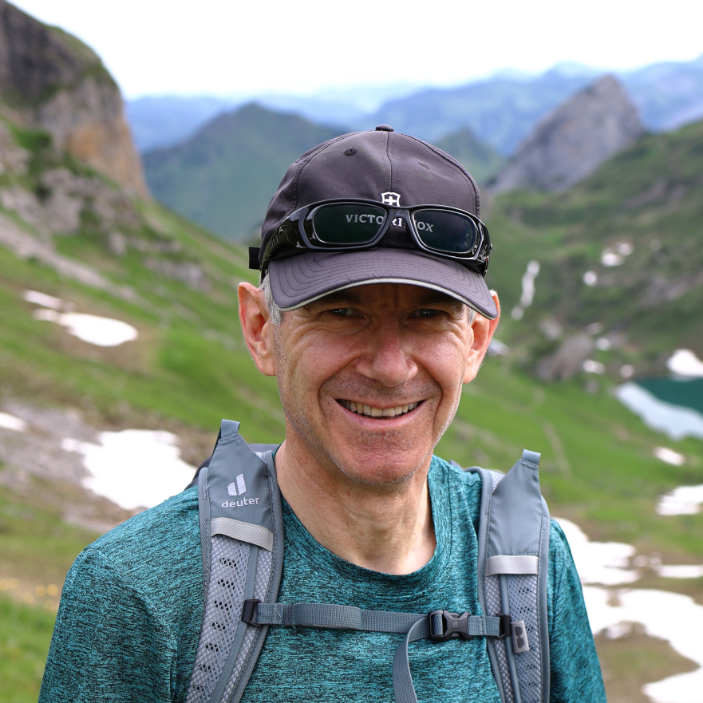
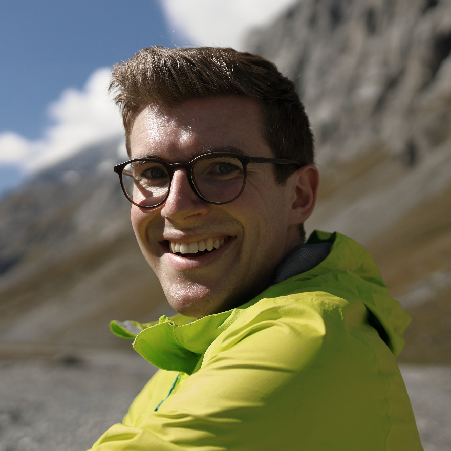

<link href="../style.css" rel="stylesheet"></link>

    

        

            
            <em>Bruno</em>
        

    

    

        

            
            <em>Pat</em>
        

    

<a href="../contributors/bruno">Bruno</a> and <a href="../contributors/pat">Pat</a> are a father/son duo that love to explore the Swiss alps.

Many of the tours you'll find here aren't ones that you'll typically find in regular tourist brochures.  We prefer to explore trails that are off the beaten track to enjoy the mountains the way that the locals for a given region do.

We've listed a number of different tours we've previously undertaken throughout Switzerland, with the primary focus of our activities being in the realm of hiking.

While one of the primary intentions of this website is for it to serve as a sort of "scrapbook" of the past trips we've done, we hope that this website can also be a useful reference for you when trying to get new ideas for weekend (or holiday) outings.