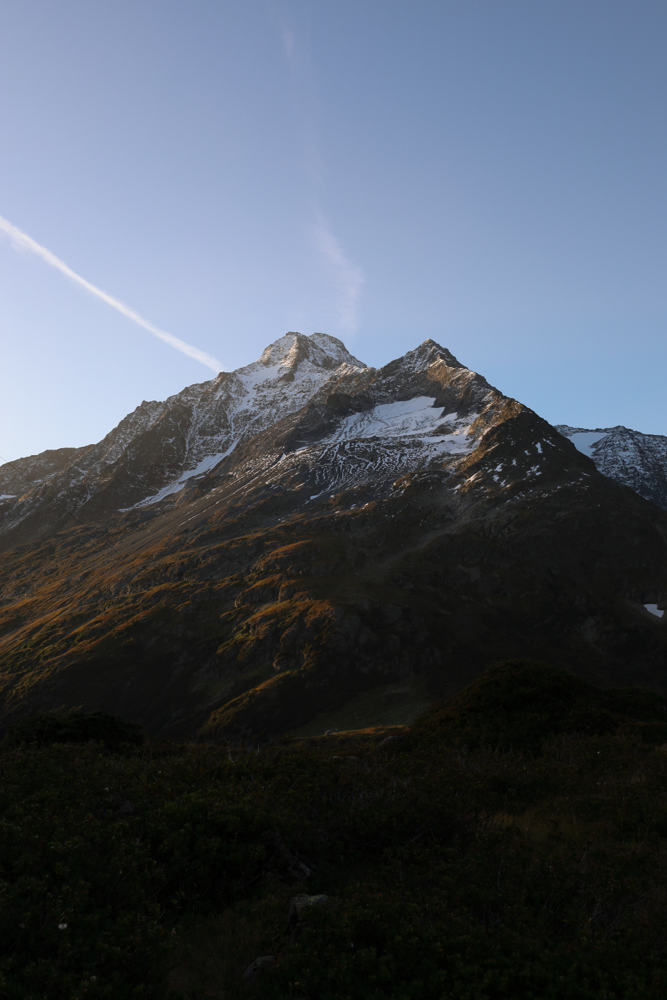
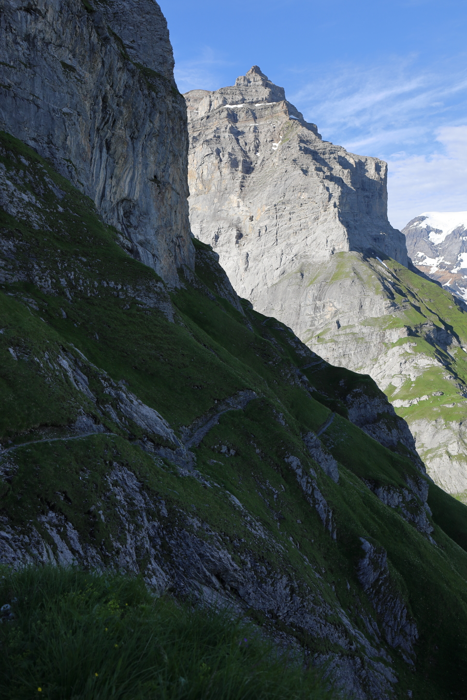

<link href="../../style.css" rel="stylesheet"></link>

---

## Brief Overview

We've added tabs and image galleries to all of the current
[hiking](../../docs/hiking/overview) posts.

### Tabs
- Splits up the content of a page into individual sections
- Requires less scrolling to get to the part that you might be interested in

Example:


{}



{}
{}

## Some Text For the Second Tab

Lorem ipsum dolor sit amet, consectetur adipiscing elit. Aliquam sodales turpis
nec elit molestie efficitur. Praesent rutrum tempus dui, sit amet rhoncus ligula
maximus quis. Vestibulum ultrices volutpat ligula. Ut commodo ut turpis ac
porta. Ut vehicula posuere mattis.

{}
{}



{}


---

### Image Galleries
- Adds a dedicated list of thumbnails for a given page
- Clicking/tapping on an thumbnail pulls up the full-sized image

Example:



---

## The Nitty-Gritty

Here are some of the implementation details for how these shortcodes work.

### Tabs

We've added a `{}` shortcode which uses Bootstrap to create dynamic
tabs for organizing the content on each tour page.  As an example, the
following shortcode


```

    {}

        ## A First Header

        

    {}
    {}

        ## Some Second Header

        Lorem ipsum dolor sit amet, consectetur adipiscing elit. Aliquam 
        sodales turpis nec elit molestie efficitur. Praesent rutrum tempus
        dui, sit amet rhoncus ligula maximus quis. Vestibulum ultrices
        volutpat ligula. Ut commodo ut turpis ac porta. Ut vehicula
        posuere mattis.

    {}
    {}

        ## Third and Final Header

        

    {}

```

would generate the these tabs:


{}

## A First Header


{}
{}

## Some Second Header

Lorem ipsum dolor sit amet, consectetur adipiscing elit. Aliquam sodales turpis
nec elit molestie efficitur. Praesent rutrum tempus dui, sit amet rhoncus ligula
maximus quis. Vestibulum ultrices volutpat ligula. Ut commodo ut turpis ac
porta. Ut vehicula posuere mattis.

{}
{}

## Third and Final Header


{}


---

### Image Galleries

We've also added a shortcode for a basic Lightbox gallery.  This can be added to
a given page using

```

```

By default, this will take the images under `assets/images/<path>` and fill in 
`<path>` with the appropriate relative path to the current page.  So for this
example, we've added a total of 4 images to the gallery:



Clicking on an image opens a larger version of the image and allows for cycling
through the other images in the gallery.

We can optionally pass the `dir` argument to specify the path we want to get
the gallery from.  So let's say we would want to pull in the gallery from
the hike at the [Chamerstock](../../docs/hiking/chamerstock), we would give in

```

```

which would have produced the following gallery:



It's still fairly bare-bones, but it gets the job done.  We'll likely polish
this up more in the future.
