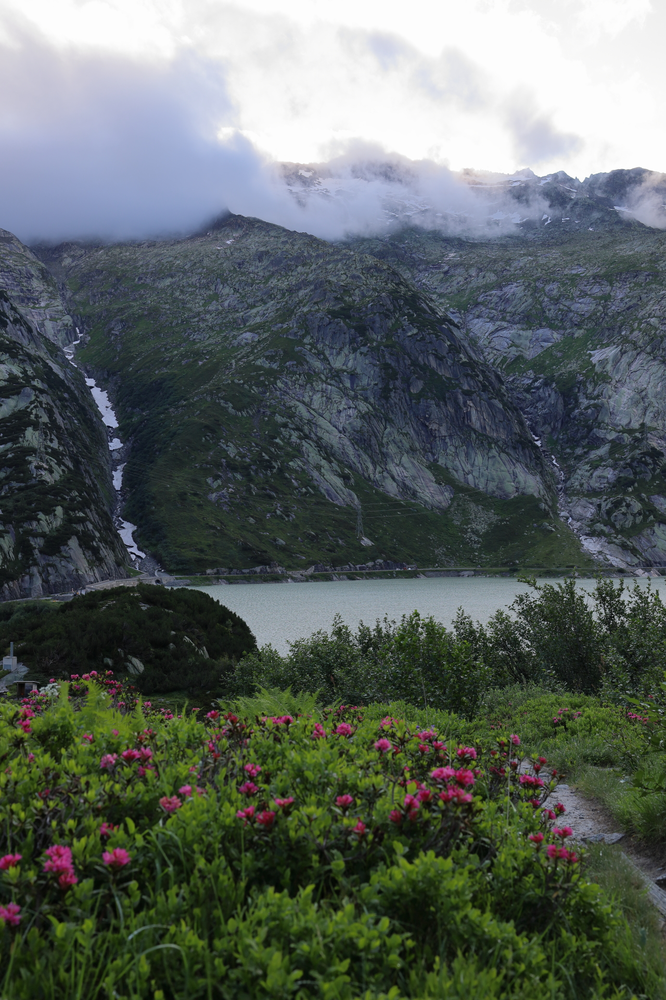
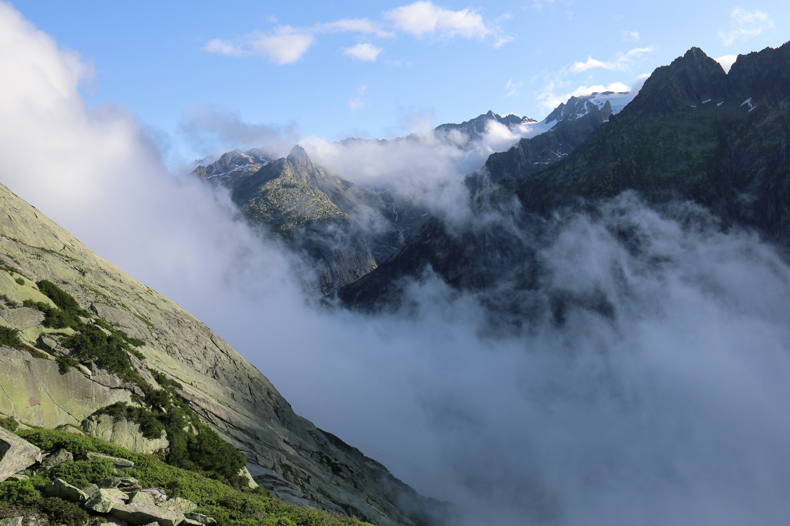
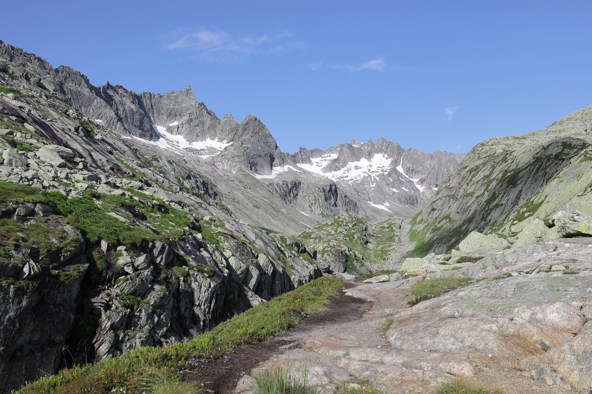
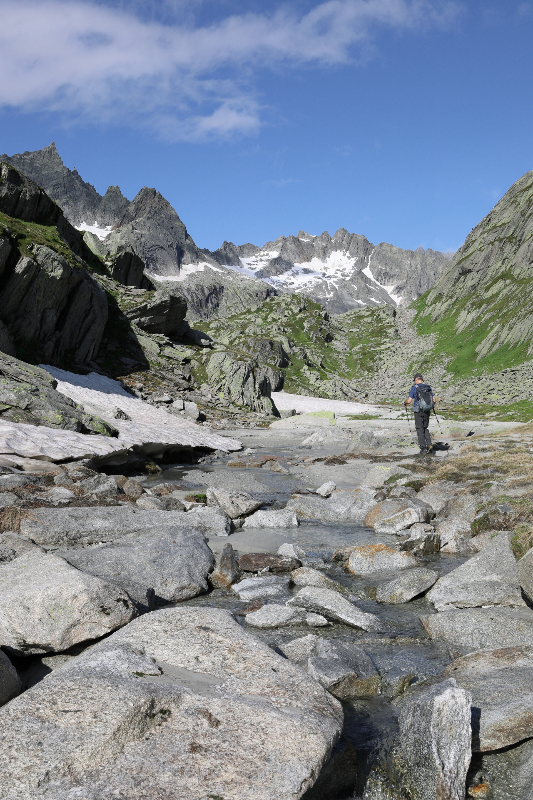
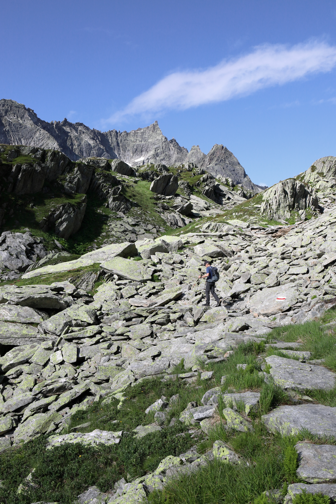
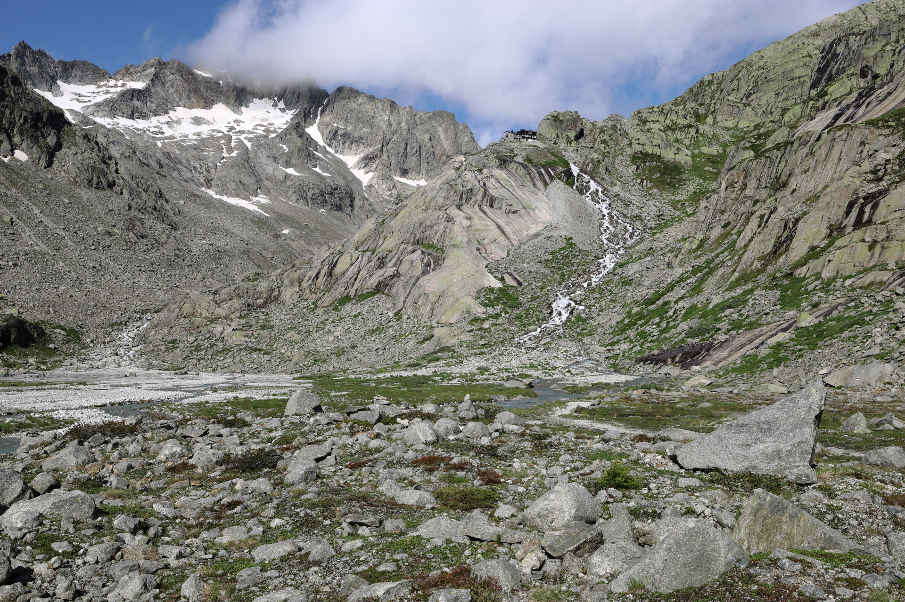
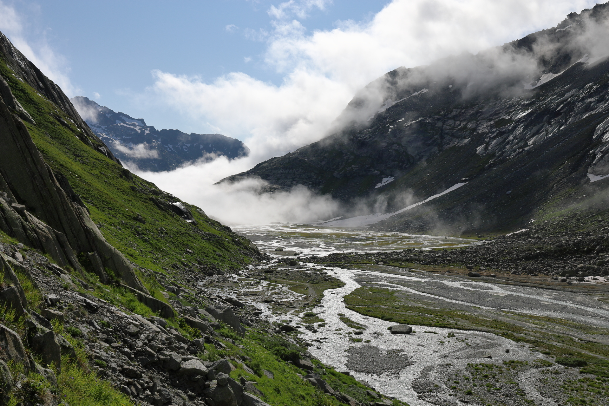
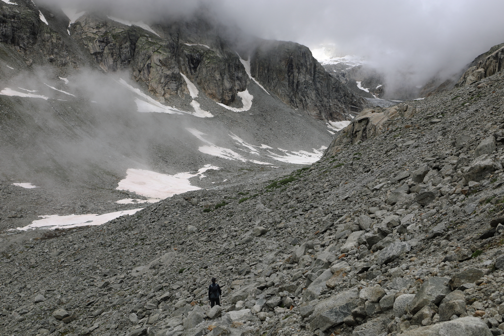
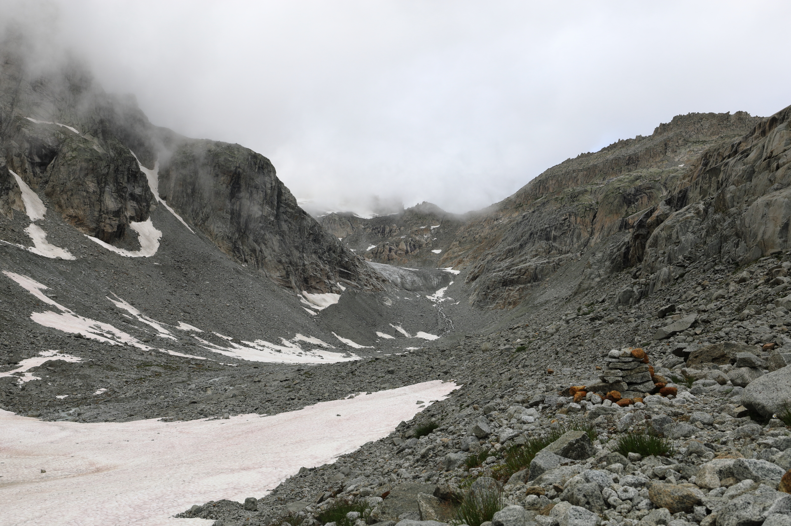
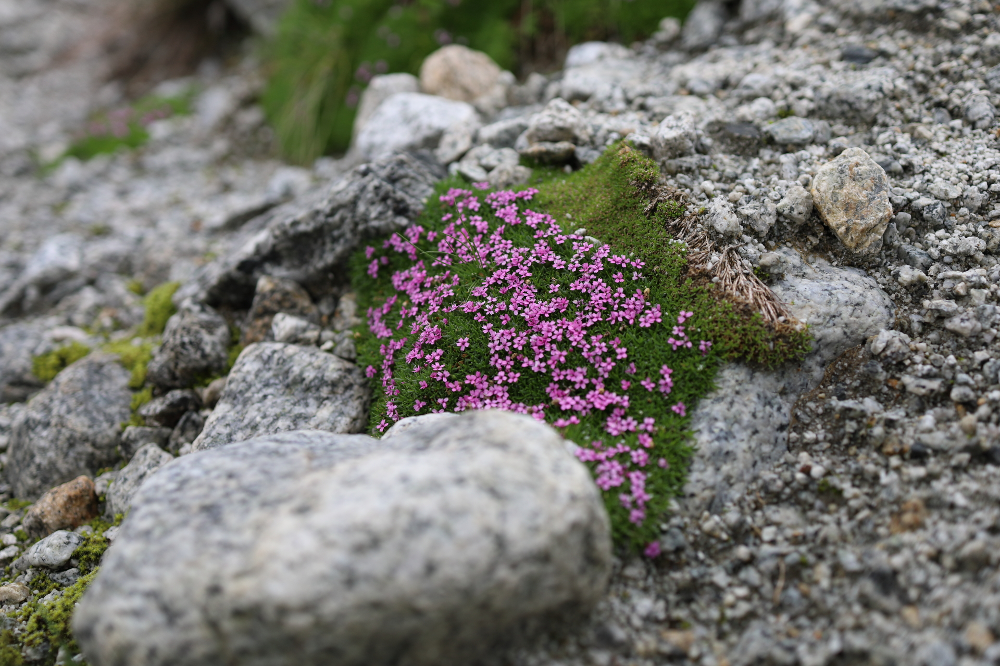

<link href="../../../style.css" rel="stylesheet"></link>

| Difficulty | [T2](../overview/#wanderskala) |
| :--- | :--- |
| &#8644; Distance | 9.8 km |
| &#8593; Up | 610 m |
| &#8595; Down | 610 m |
| Notable Locations | Räterichsboden, Bächlitalhütte SAC |
| Public Transit Access? | Yes |
<!-- | Map Download | [PDF](.pdf), [GPX](.gpx) | -->


{}

## Quick Summary

- Day hike from the <hl>Räterichsbodensee</hl> (near the <hl>Grimsel Pass</hl>) to the <hl>Bächlitalhütte SAC</hl>
- The starting point is easily accessible with both car and public transit
- The ascent and descent take the same path; there is only one officially marked path which leads to the <hl>Bächlitalhütte</hl>
- If we were to do this hike again, we'd go when the ground would be dry.  While the hike itself isn't very dangerous, most of the hike is on smooth rocks which can make the path quite slippery when wet.

{}
{}

{}

{}

{}
{}

## Ascent to the Bächlital

## Along the Bächlital

.  The majority of the path leading to the hut hugs the right side of the valley.")

 which makes the ascent pretty enjoyable.")

## Venturing Beyond the Hut

## A Foggy Return

.")

{}
{}



{}

