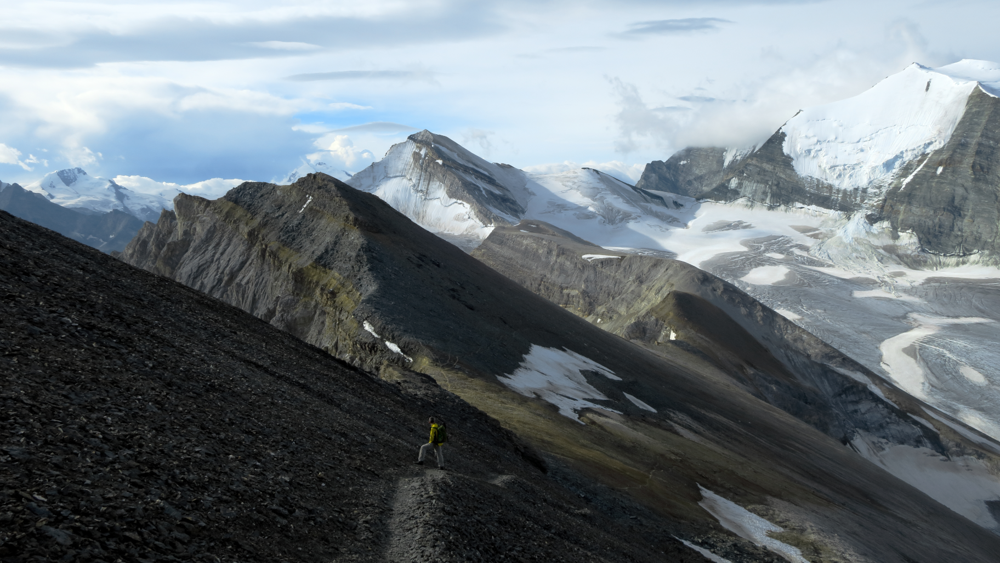

<link href="../../../style.css" rel="stylesheet"></link>

| Difficulty | [T3+](../overview/#wanderskala) |
| :--- | :--- |
| Numer of Days | 3 |
| &#8644; Total Distance | 24.9 km |
| &#8593; Up | 1820 m |
| &#8595; Down | 1880 m |
| Notable Locations | Turtmannhütte SAC, Üssers Barrhorn, Schöllijoch, Gruben |
| Public Transit Access? | Yes |

## Quick Summary

- 3 day hike in <hl>Turtmanntal</hl> in the <hl>Wallis</hl> (one valley over from Zermatt)
- We only used public transport to get to and from the Turtmanntal
- The <hl>Üssers Barrhorn</hl> (3610m) has become quite renowned in recent years as being one of the highest peaks in the Alps with an officially marked hiking trail

---

## Day 1: Ascent to the Turtmannhütte SAC

| Difficulty | [T2](../overview/#wanderskala) |
| :--- | :--- |
| &#8644; Distance | 5.6 km |
| &#8593; Up | 590 m |
| &#8595; Down | 0 m |
| Notable Locations | Vorder Sänntum, Turtmannsee, Turtmannhütte SAC |
| Public Transit Access? | Yes |


{}

### Summary

- Travelled to the <hl>Turtmann (Talstation)</hl> via public transit
  - Train to Turtmann
  - PostAuto to the cable car station
- Took the cable car to <hl>Oberems</hl> and then an alptaxi (part of the standard SBB timetable) to the <hl>Vorder Sänntum</hl>
- Hiked along gravel roads to the <hl>Turtmannsee</hl>
- From the Turtmannsee, we took the (only) hiking trail leading up to the <hl>Turtmannhütte SAC</hl>
- Stayed overnight at the hut to prepare for the next day

{}
{}

{}

{}

{}
{}

### Arrival and Ascent to the Turtmannsee

.  The large glacier in the center of the image is the Turtmanngletscher.")

 can be seen up on the left-hand side of the valley.")

### Turtmannhütte SAC

{}
{}



{}


---

## Day 2: Üssers Barrhorn

| Difficulty | [T3+](../overview/#wanderskala) |
| :--- | :--- |
| &#8644; Distance | 9.6 km |
| &#8593; Up | 1010 m |
| &#8595; Down | 1010 m |
| Notable Locations | Turtmannhütte SAC, Üssers Barrhorn, Schöllijoch |
| Public Transit Access? | N/A |
<!-- | Map Download | [PDF](.pdf), [GPX](.gpx) | -->


{}

### Summary

- With this being the most strenuous of the three days, our primary objective for the day was to summit the <hl>Üssers Barrhorn</hl>
- The crux of the hike was a short ascent up a somewhat exposed couloir
  - This was secured by a metal wire which acted as a handhold
  - Since it was raining on our descent, this section was quite slippery given the fairly smooth rock
- The remainder of the hike consists mainly of moraine and scree

{}
{}

{}

{}

{}
{}

### An Early Start up the Gässi
*We started the next morning around 4 AM to try and beat the inclimate weather which was scheduled to roll in around lunch time.  The crux of the hike (see below) was only about a 30 minute walk from the hut; there was only one officially marked trail that lead to the crux.*

 was secured by a metal wire.  It is somewhat exposed, so falling here would be less than ideal.")

### Ascent to the Üssers Barrhorn

.")

.  A good chunk of the ascent consisted of this kind of terrain.")

.  The word 'Üssers' is Swiss German for 'Äußeres', meaning 'outer'.")

 that are marked with Steimännli instead of with conventional painted trail markers.  This spot is about 200m - 300m below the summit.")

.")

### Descent to the Schöllijoch 

 is already shrouded in the promised clouds.  It's about time we get off this mountain.")

 and the <hl>Üssers Barrhorn</hl> (left).  The group that is traversing below the <hl>Inners Barrhorn</hl> was on their way up to the <hl>Üssers Barrhorn</hl>.  However, when we met them later at the Turtmannhütte, they said that it started snowing once they approached the summit.  I guess starting early payed off.")

### Return to the Turtmannhütte SAC

{}
{}



{}


---

## Day 3: Return to Gruben

| Difficulty | [T2](../overview/#wanderskala) |
| :--- | :--- |
| &#8644; Distance | 9.7 km |
| &#8593; Up | 220 m |
| &#8595; Down | 870 m |
| Notable Locations | Turtmannhütte SAC, Ämser Schafalpu, Gruben |
| Public Transit Access? | Yes[^1] |
<!-- | Map Download | [PDF](.pdf), [GPX](.gpx) | -->


{}

### Summary

- A relaxing and comparatively short hike to the previous day
- From the <hl>Turtmannhütte SAC</hl>, we followed the hiking path along the upper part of the Turtmanntal

{}
{}

{}

{}

{}
{}

### Hiking Along the Turtmanntal

.  We thought it was pretty neat that the hiking trail goes over the ridge of this quasi-dam.")

{}
{}



{}


[^1]: There was indeed an alp taxi that was part of the standard SBB timetable.  However, it drove very infrequently so we decided to charter an alp taxi ride from Gruben back to Oberems.  While quite a bit more expensive than the standard alp taxi faire, it was well worth the cost given how many hours of waiting we ended up saving.