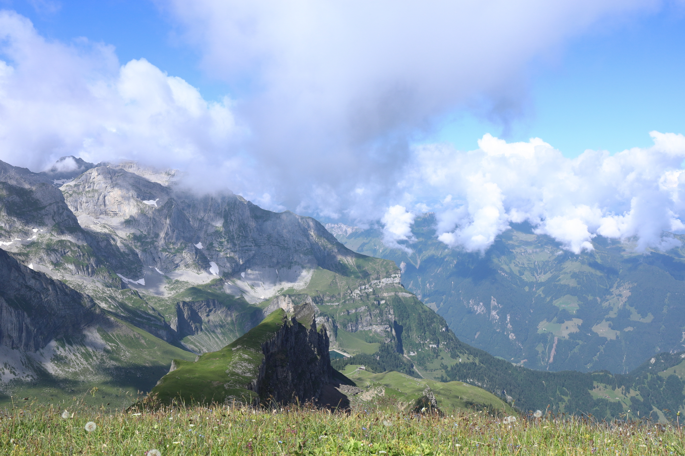

<link href="../../../style.css" rel="stylesheet"></link>

| Difficulty | [T3+](../overview/#wanderskala) |
| :--- | :--- |
| &#8644; Distance | 11.1 km |
| &#8593; Up | 800 m |
| &#8595; Down | 720 m |
| Notable Locations | Oberrickenbach, Chaiserstuel |
| Public Transit Access? | Yes |


{}

## Quick Summary

- A nice hike across many meadows in <hl>Nidwalden</hl>.
- Drove to <hl>Fell</hl> near <hl>Oberrickenbach</hl>.
  - Took two very small cable cars (so-called <hl>Buiräbähnli</hl>) up to the starting point.
    - The first was <hl>Luftseilbahn Fell-Spis</hl>.
    - The second was <hl>Luftseilbahn Spis-Sinsgäu</hl>.
  - On the way down we took the <hl>Luftseilbahn Fell-Chrüzhütte</hl>.
- The ascent up to the ridge leading to the <hl>Chaiserstuel</hl> was extremely steep (marked <hl>blue-white-blue</hl>) so we were quite happy to have had our poles with us.
- There was only one very short (~15m) scrambling passage to get to the top of the Chaiserstuel.
- We hiked part-way to the <hl>Bietstöck</hl> but decided to turn around before getting to the cross because it was extremely exposed.

{}
{}

{}

{}

{}
{}



{}
