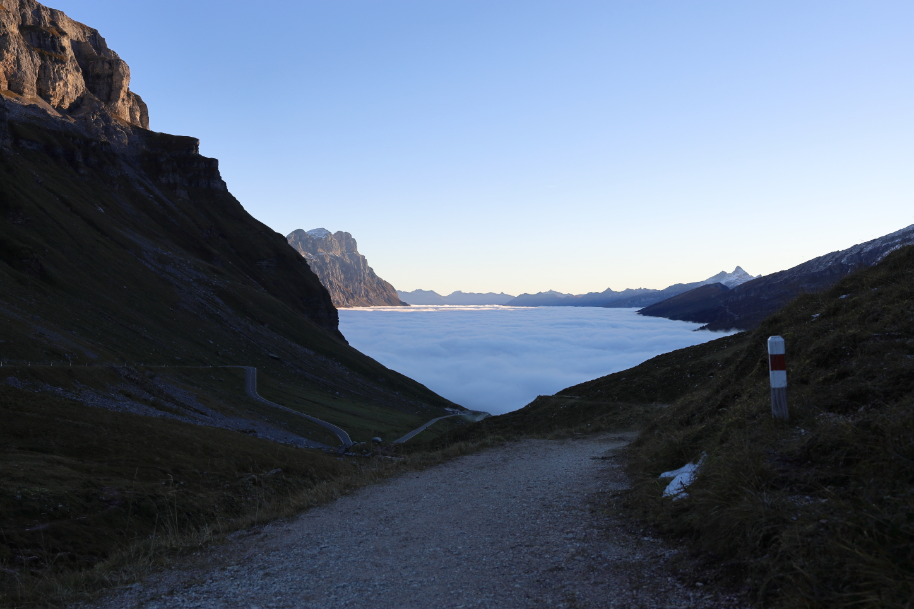

<link href="../../../style.css" rel="stylesheet"></link>

| Difficulty | [T3](../overview/#wanderskala) |
| :--- | :--- |
| &#8644; Distance | 16.3 km |
| &#8593; Up | 750 m |
| &#8595; Down | 700 m |
| Notable Locations | Klausenpass, Clariden Glacier, Fisetengrat, Chamerstock, Urnerboden |
| Public Transit Access? | No |


{}

## Quick Summary

- Drove to the top of the <hl>Klausenpass</hl>
- Hiked down along the side of the valley
- Path lead all the way to the <hl>Chamerstock</hl> at the end of the <hl>Fisetengrat</hl>
    - Turned around at this point and hiked back to the cable car station near the <hl>Fisetenpass</hl>
- Took the cable car down to <hl>Urnerboden</hl>
- Caught the PostAuto from <hl>Urnerboden</hl> back up to the top of the <hl>Klausenpass</hl>
    - When we went there was only one PostAuto per day that went up to the top of the Klausenpass so we had to be very careful to make sure we didn't miss this one

{}
{}

## Coming soon...

{}
{}

## Arrival

We arrived at the top of the <hl>Klausenpass</hl> just as the sun was coming up.
The weather forecast was absolutely spot-on: the clouds were just under the
elevation of the pass.  The sea of clouds looked solid enough to walk on.

You may have noticed that we've listed this hike as _not_ being reachable by
public transit.  While it _technically_ possible to get to the top of the pass
via the PostAuto, you would end up starting so late in the morning that it
probably wouldn't be feasible to get all the way to the Chamerstock and then
back down to Urnerboden in time to get a PostAuto back to civilization.

## Clariden Glacier

The first main waypoint for this hike is the <hl>Clariden Glacier</hl> (or at least what's left of it).  The hike from the parking lot at the top of the pass is fairly unproblematic — not super steep and very well marked.  We were lucky that the ground was frozen as it would have likely been quite muddy had it been above the freezing mark.  Once we got a little closer to the glacial lake, there was a little more snow on the ground which made for some nice photos while not being obtrusive to walk through.

The route down to the lake is fairly rocky in contrast to the first part of the
hike since the lake is located in a gully that's flanked by glacial moraines
(essentially big piles of rock that the glacier burped out as it receded).
There's a handy aluminum bridge that would likely be pretty important for the
warmer months where there's more glacial runoff.  With that being said, the
water level in the lake was low enough that this wasn't necessary for us to use.

While it isn't absolutely necessary to go down to the lake (we could instead have just followed the path further along the moraine and bypassed the lake all-together), it's a really photogenic spot.

## Gemsfairen

The next portion of the hike goes along the upper portion of the valley; this
area is called <hl>Gemsfairen</hl>.  One of the great things with this part of
the hike is that you have an uninterrupted view of the mountains down the
valley.

After descending a ways from the glacial lake, you'll get to a small collection
of buildings called <hl>Gemsfairenhüttli</hl>.  Make sure to continue along the
regular hiking path and _not_ the gravel road.  While they both bring you to the
same place, the path along the hiking path brings you somewhat higher up the
side of the valley and helps you to maintain a good view down the valley.

The last bit along the Gemsfairen has a small section that is secured with
chains as it is a little bit exposed.  This spot is unproblematic though — the
rock here is good and the chain offers a nice handhold.

## Fisetenpass and the Fisetengrat

Not long after the bit with the chains towards the end of the Gemsfairen, we
arrived at the <hl>Fisetenpass</hl>.  Up until this spot, the hike had been
pretty much devoid of human life — we had the trails entirely to ourselves.
Things got somewhat busy once we got to the Fisetenpass though as this is the
terminus of the cable car that goes up from Urnerboden.  Definitely not the end
of the world, but I could see this being very busy during high season in
July or August.

Next, we continued over the <hl>Fisetengrat</hl> heading towards the Chamerstock.  From a scenic point of view, this was definitely the most impressive part of the hike.  You have an absolutely incredible 360 degree view from up on this ridge.  I certainly understand why they built a cable car to get viewers up here more easily — it's absolutely spectacular up there.

.")

## Chamerstock and Return to Urnerboden

The peak at the end of the Fisetengrat is the <hl>Chamerstock</hl>.  While
definitely a worthwhile destination, there wasn't much for us to see at the
Chamerstock compared to the hike along the Fisetengrat since the city of Linthal
was completely swallowed by the clouds.  That's fine though — the sea of clouds
below us had gotten quite thick by this point and really made the landscape look
like something out of a postcard.

We didn't spend much time at the Chamerstock since we wanted to get back to the
cable car with plenty of time to make the (one and only) PostAuto ride back up
from Urnerboden to the top of the Klausenpass.  Even though we had to re-trace
our steps for this part of the hike across the <hl>Fisetengrat</hl>, it was like
doing an entirely new part of the hike since we now had a view up the valley
back towards the Klausenpass and the Gemsfairenstock.

 and the Gemsfairenstock (right).")

We got extremely lucky at this point: right as we were about to return to the
<hl>Fisetenpass</hl>, the clouds (which had risen in elevation by this point)
began spilling over the ridge.  The visibility along the ridgeline was very low
— not at all dangerous, but just unfortunate for anyone wanting to snap some
more pictures.  Luckily the cable car is just a stone's throw from the
Fisetenpass so this wasn't at all an issue for us.

We took the cable car down to <hl>Urnerboden</hl> and hung around there for the
PostAuto.  Be careful to make sure that you don't miss this bus because **there
is only one bus per day that goes from Urnerboden to the Klausenpass**.  If you
have time, I'd definitely check out the Alpkäserei Urnerboden, which is just
across the street from the PostAuto stop.  They have some absolutely delicious
locally produced cheese here — would highly recommend.  

The PostAuto ride up to the top of the <hl>Klausenpass</hl> was not particularly
eventful.  Again just make sure you don't miss the bus or you'll be hitchhiking
your way up to the top of the pass!

{}
{}



{}
