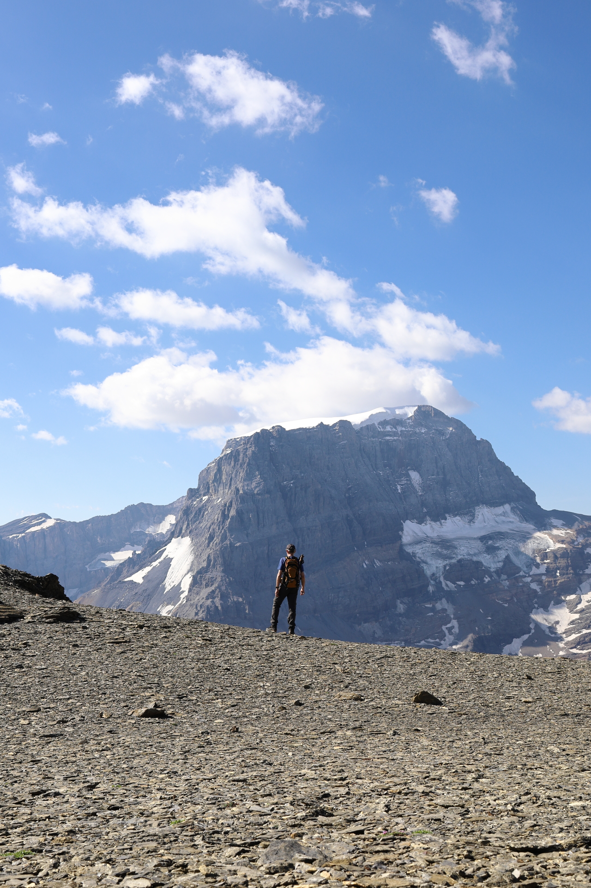

<link href="../../../style.css" rel="stylesheet"></link>

| Difficulty | [T4](../overview/#wanderskala) |
| :--- | :--- |
| &#8644; Distance | 9.0 km |
| &#8593; Up | 890 m |
| &#8595; Down | 890 m |
| Notable Locations | Urnderboden, Fisetenpass, Rund Loch, Gemsfairenjoch, Gemsfairenstock |
| Public Transit Access? | No |


{}

## Quick Summary

- Parked at the cable car in <hl>Urnerboden</hl>.
  - Took the first cable car up to the <hl>Fisetenpass</hl>.
- From the Fisetenpass, we followed the alpine trail (white-blue-white) up to the <hl>Rund Loch</hl>.
  - The Rund Loch (means "round hole" in German) is a very large window/hole in the side of the mountain.
- Continued up the alpine trail towards the <hl>Gemsfairenjoch</hl>.
- The crux of the hike was a short scrambling passage (~50m) which was secured by chains.
- From the Gemsfairenjoch, we headed east up the steep ridge to the <hl>Gemsfairenstock</hl>.
- Had a brief lunch at the peak with an incredible view of the surrounding mountains (Clariden, Tödi, etc.).
- Descended the same way that we took on the way up

{}
{}

{}

{}

{}
{}



{}
