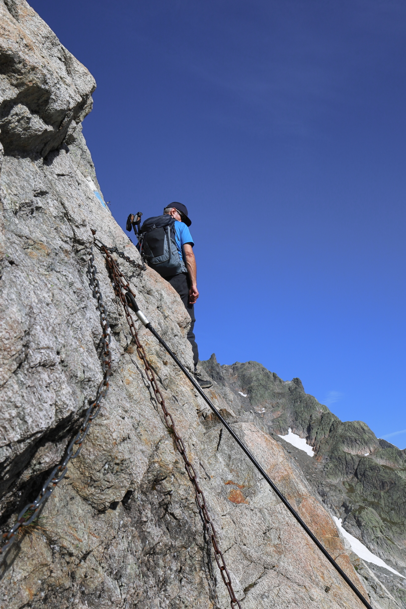
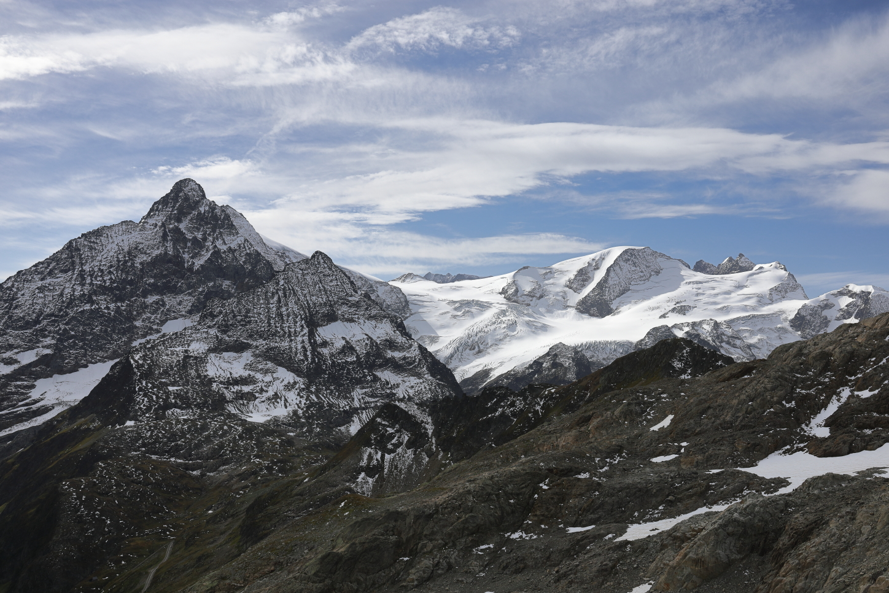
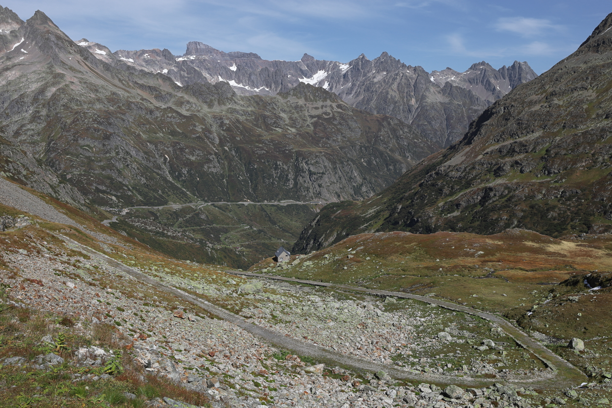

<link href="../../../style.css" rel="stylesheet"></link>

| Difficulty | [T4+](../overview/#wanderskala) |
| :--- | :--- |
| &#8644; Distance | 11.9 km |
| &#8593; Up | 1180 m |
| &#8595; Down | 1180 m |
| Notable Locations | Sustlihütte SAC, Guferjoch, Sustenlochfirn, Sustenpass |
| Public Transit Access? | Yes |


{}

## Quick Summary

- Drove to the <hl>Sustenbrüggli</hl> close to the top of the <hl>Sustenpass</hl>
- Hiked up the <hl>Leiterweg</hl> to the <hl>Sustlihütte SAC</hl>
- Traversed along the valley following the alpine trail towards the base of the <hl>Guferjoch</hl>
- Ascended the Guferjoch from the eastern side
    - The ascent was secured with chains, but was very exposed
- Descended the Guferjoch on the western side onto the <hl>Sustenlochfirn</hl>
    - Similar to the ascent, the descent was also very exposed and had several near-vertical scrambling passages
- Took the "new" path over the <hl>Sustenlochfirn</hl>
- Followed the trail to the <hl>Sustenpass</hl>
- Hiked along the retired pass road back to where we parked at the <hl>Sustenbrüggli</hl>

{}
{}

{}

{}

{}
{}

## Arrival

We parked near the <hl>Sustenbrüggli</hl> restaurant (there's a decently sized
parking lot there).  We could have alternatively taken the PostAuto to the stop
<hl>Meien, Sustenbrüggli</hl>, although we decided to taking the car instead since
this is a fairly lengthy hike and we wanted to get started early in the
morning.  

Alternatively, we could have arrived the evening before and stayed at the <hl>Sustlihütte SAC</hl> to get an early start the next morning.

## Sustlihütte SAC (Leiterweg)

The first part of this hike had two possible routes: the <hl>Normalweg</hl>
(normal path) or the <hl>Leiterweg</hl> (ladder path).  The ladder path involved
4 ladders and was quite a good warmup for some of the trickier passages later on
in the hike.  The spots with the ladders were very well secured and were not
particularly exposed.  With that being said, two of the ladders were somewhat
high, so being comfortable with heights was definitely important.

    

        

            
            <em>Ladders along the <hl>Leiterweg</hl>.</em>
        

    

    

        

            
            <em>Looking towards the <hl>Sustenpass</hl>.</em>
        

    

At the end of the <hl>Leiterweg</hl> we reached the first waypoint of
the day: the <hl>Sustlihütte SAC</hl>.  We didn't stick around here for long
since the ascent up from the parking lot wasn't particularly long and we wanted
to keep moving.  

Although the Leiterweg had been marked as a regular hiking path
(white-red-white markings), the path as we continued on from the Sustlihütte SAC
changed over to an alpine path (white-blue-white markings).

## Traverse Across the Stöss

The hike from the Sustlihütte SAC to the base of the <hl>Guferjoch</hl> was a ton of fun.  Beautiful views, fun terrain, not a soul around...  Just an all around great trail.  There were one or two slightly exposed spots along the traverse along the <hl>Stöss</hl>, but the path overall was fairly well marked.

The dramatic shadows down the valley were truly incredible.

## Ascent to the Guferjoch

As is the case with many mountain paths, the exact path along the Stöss to the Guferjoch is not very apparent from the vantage point of the Sustlihütte.  Here's the approximate path to reach the Guferjoch:

While most of the path so far had been in the realm of
[T3](../overview/#wanderskala), the ascent to the Guferjoch seems to typically
be rated at around a [T4+](../overview/#wanderskala).  There were a number of
fairly sketchy scrambling passages which are largely secured by chains and steel
cables.  The approximate route up the rock-face to the joch can be seen here:

The first portion of the scramble was secured by a single long steel wire.  This
wire made the first part of the ascent considerably easier since good handholds
were somewhat tricky to find in places due to the rocks having been smoothed
considerably from glacial erosion.

 steel wire.")

Following this first scramble, we traversed to the right-hand side of the rock-face, which was secured by a number of chains.

The third and final traverse moved back to the left-hand side of the face, back
towards the joch.  This was by far the most challenging part of the ascent due
to there being several small near-vertical scrambling sections.

Once at the top, we were greeted with an incredible view over both sides of the valley — the sweat it took to get up here was definitely worth it!

## Descent to the Sustenlochfirn

The descent from the Guferjoch to the <hl>Sustenlochfirn</hl> was somewhat similar to the ascent to the Guferjoch with most of the route being secured by chains.  There are again a few near-vertical sections that were quite tricky to traverse here.  The approximate route can be seen below:

 is not visible from this perspective.")

Something that became apparent to us when we got down to the <hl>Sustenlochfirn</hl> was that there are two paths we could have taken across the firn.  The first (older) path went part way across the firn, over the rock, and then back onto the firn.  However, two hikers that we met on our way down from the joch suggested to us that we follow the (new) path, which leads all the way across the firn.

## Sustenpass

The hike back to the <hl>Sustenpass</hl> was considerably more relaxed than the ascent/descent to the <hl>Guferjoch</hl>.  There were quite a few snowfields that needed crossing, but none of them were exposed.

The path was generally well marked, both on the path and when crossing the snowfields.  Note that some of the portions across some of the snowfields were marked by Steimännli (deliberately placed piles of rocks) as opposed to white-blue-white markings.

")

## Return via 19th Century Pass Road

Once we got to the <hl>Sustenpass</hl>, we walked along the old 19th century pass road to get back to <hl>Sustenbrüggli</hl>.  This was a nice chill way to end an otherwise (fairly) strenuous hike.  It's also very impressive to see the engineering they already had back in the day.

{}
{}



{}
