<link href="../../../style.css" rel="stylesheet"></link>

| Difficulty | [T2](../overview/#wanderskala) |
| :--- | :--- |
| &#8644; Distance | 9.4 km |
| &#8593; Up | 1060 m |
| &#8595; Down | 1060 m |
| Notable Locations | Erstfeldertal, Kröntenhütte SAC |
| Public Transit Access? | No[^1] |
<!-- | Map Download | [PDF](.pdf), [GPX](.gpx) | -->

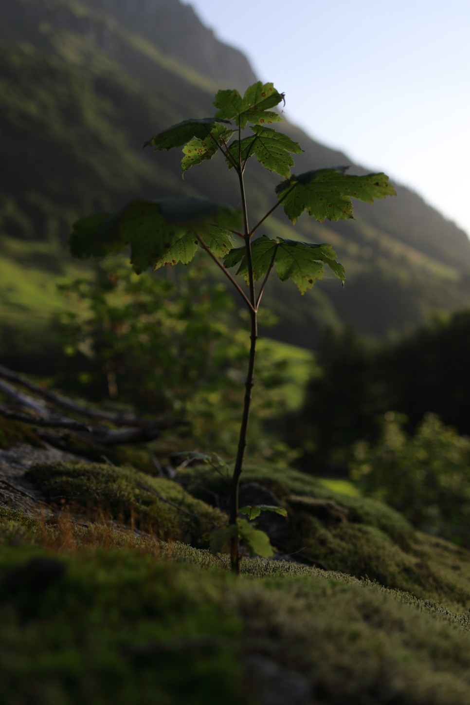


{}

## Quick Summary

- A very warm hike to the <hl>Kröntenhütte SAC</hl> near the city of <hl>Erstfeld</hl>.
- <hl>Special permit required</hl> to drive up the <hl>Erstfeldertal</hl> was required; a day permit cost about 20.- and could be purchased at the Kiosk outside of the Migros on Gotthardstrasse
- We decided to hike up on the southern side of the valley instead of the northern side.  Most people seemed to hike up along the river on the north side so we had the trail mostly to ourselves if you hike up on the southern side
- As the thick green foliage suggests, this valley is quite temperate.  We decided to go early in the morning because it can get extremely hot here later in the day during the summer months
- We thoroughly enjoyed making a stop at the <hl>Obersee</hl> near the <hl>Kröntenhütte</hl>

{}
{}

## Coming soon...

{}

{}
{}

## Ascent to the Kröntenhütte SAC

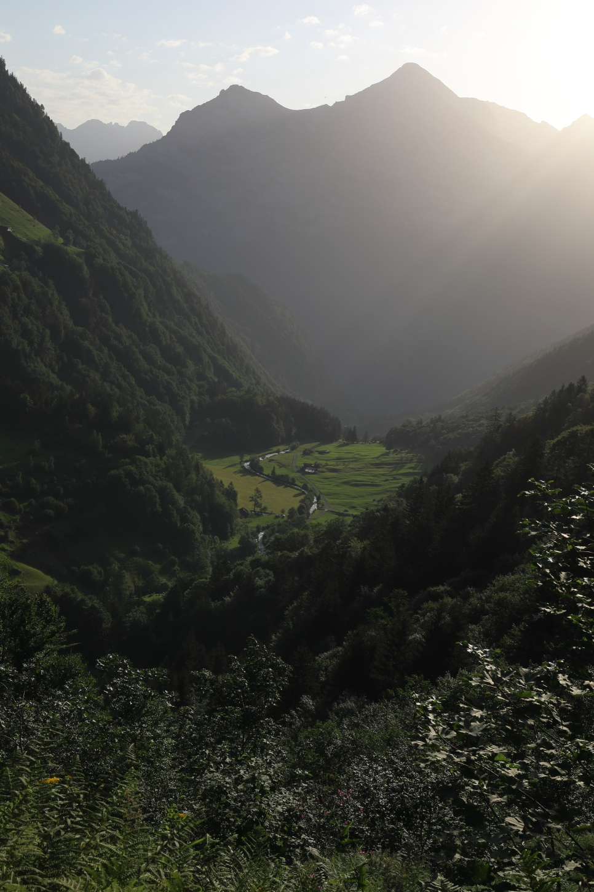

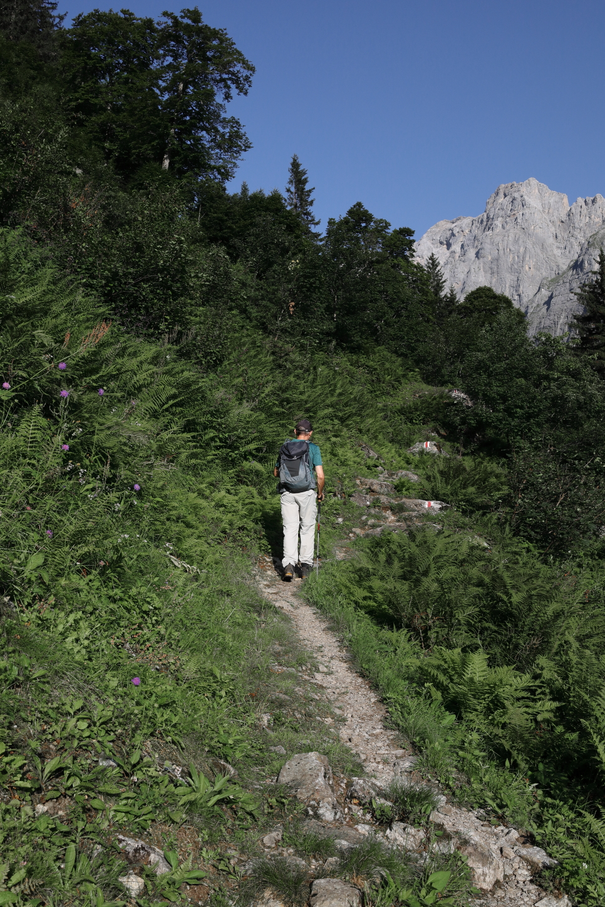

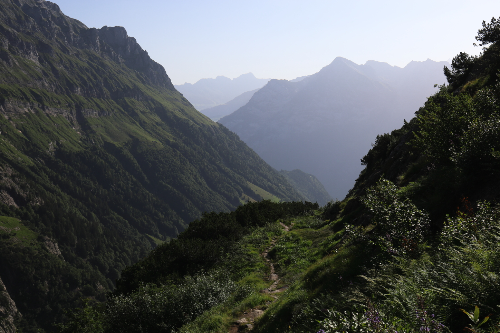

## Kröntenhütte and the Obersee

 on the left side of the image is the <hl>Steinchälenfurggli</hl> which has an alpine path (marked white-blue-white) that goes over to the next valley to the <hl>Leutschahhütte SAC</hl>.")

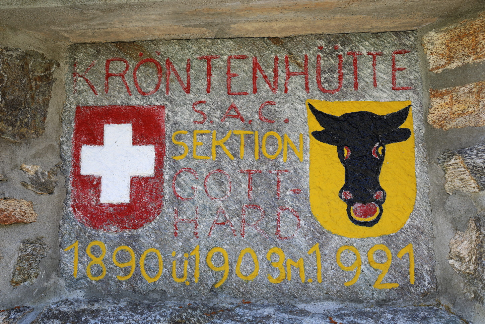

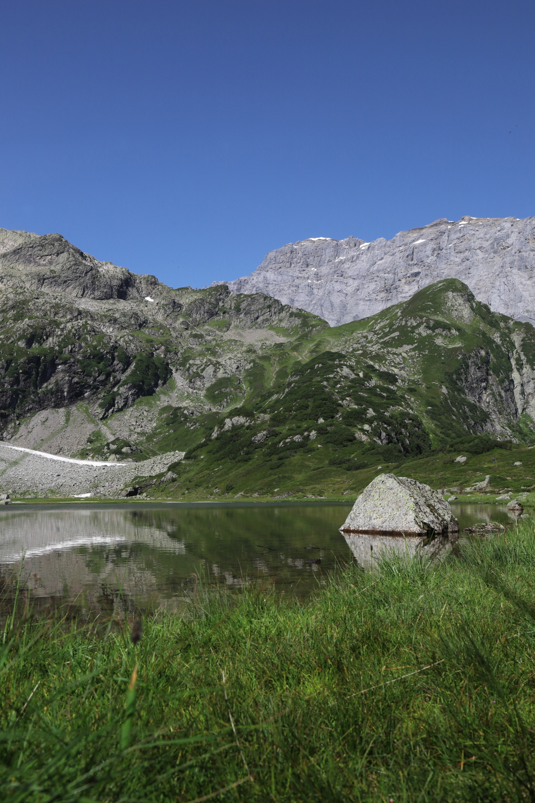

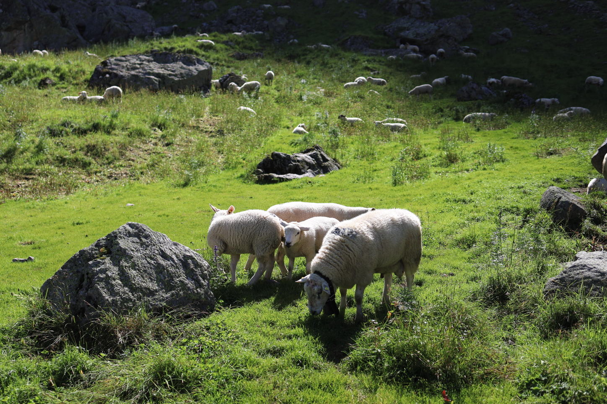

## Return Along the Alpbach

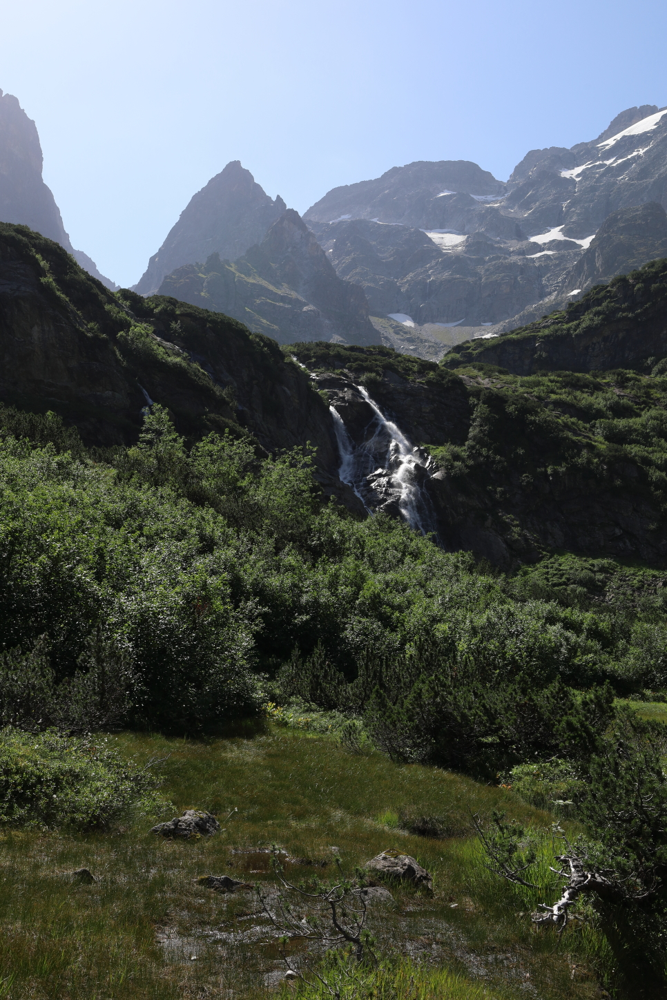

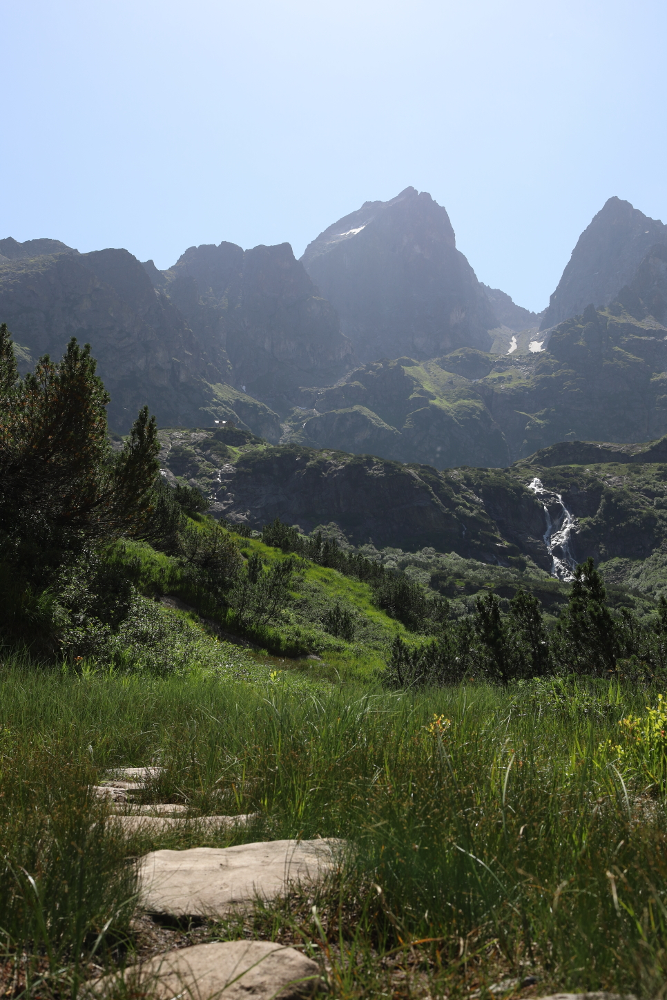

 exposed part of the hike.  This short passage is immediately after the <hl>Fulensee</hl> and took us down to the <hl>Alpbach</hl> river.  While the path here is quite wide and most of the descent is secured by chains, I could imagine this being a little more sketchy when wet.")

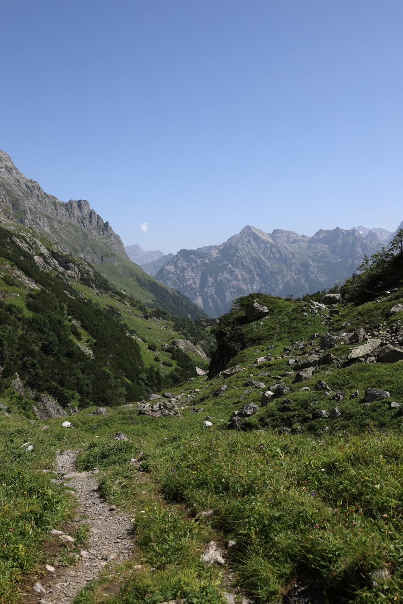

, I think describing it as a river is a little more fitting.")

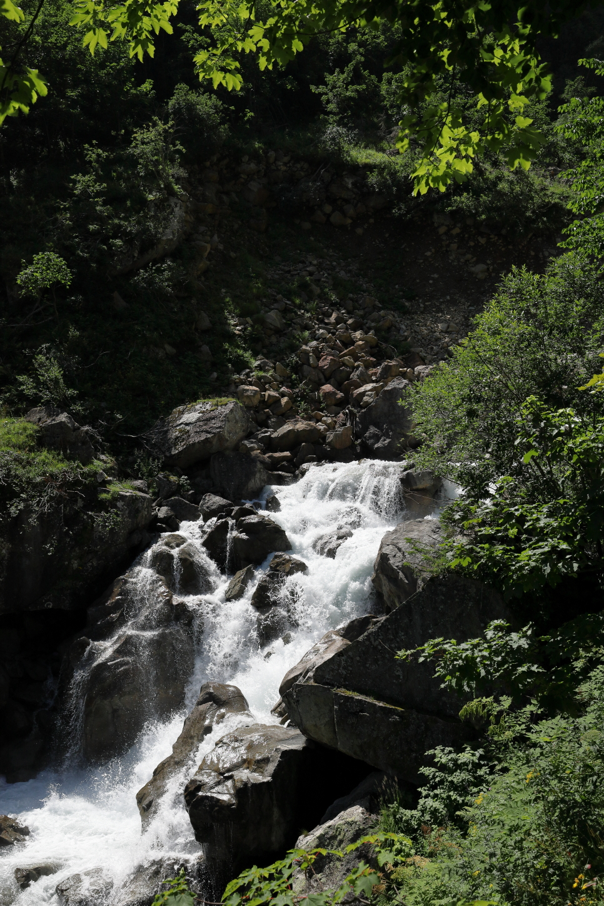

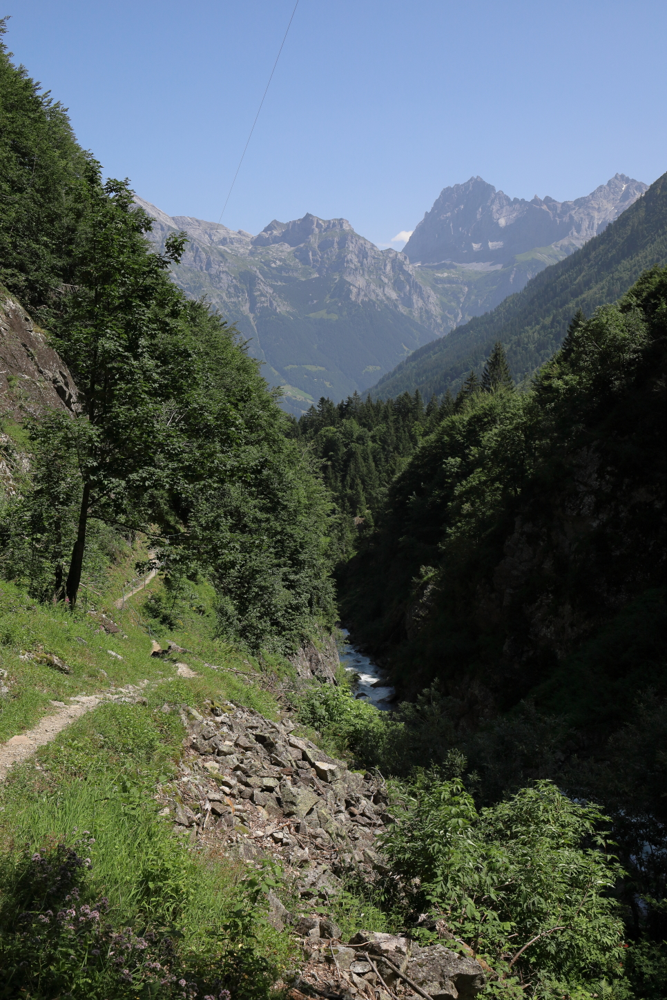

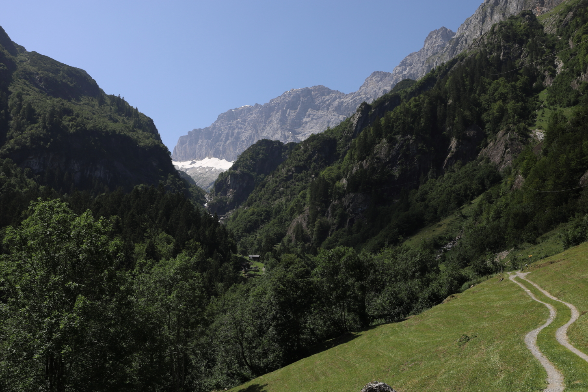

{}
{}



{}


[^1]: There is an alp taxi that we could have taken from Erstfeld up to Bodenberg, but this was not part of the standard SBB timetable.