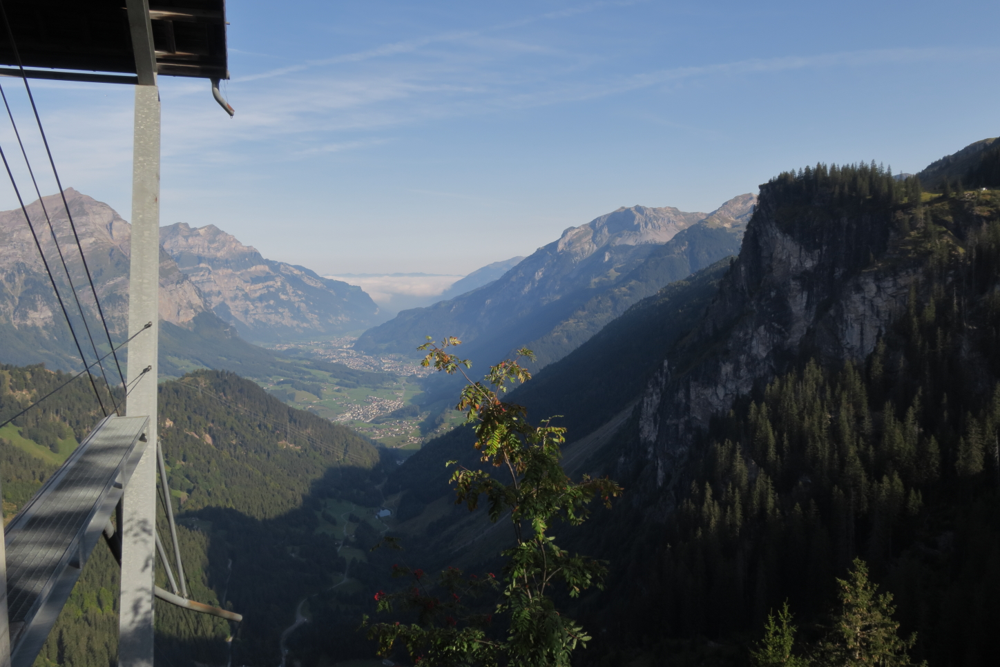
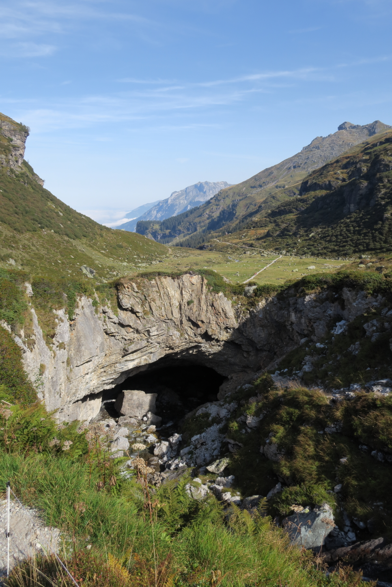
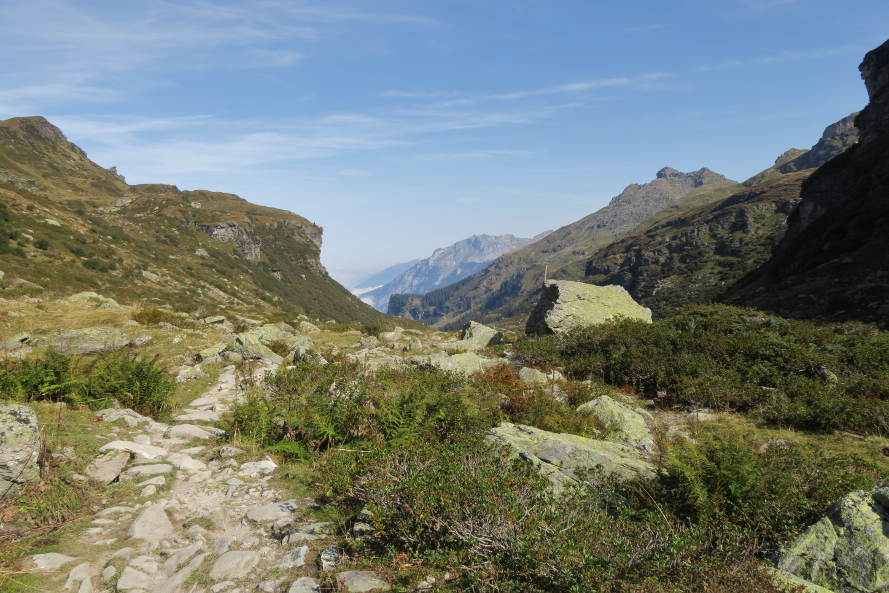
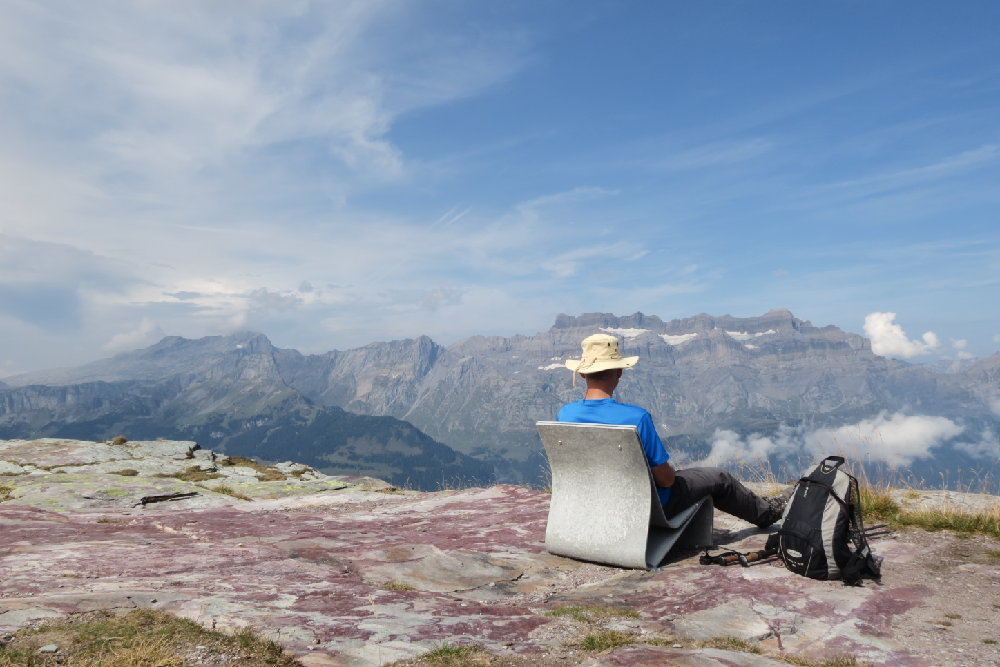
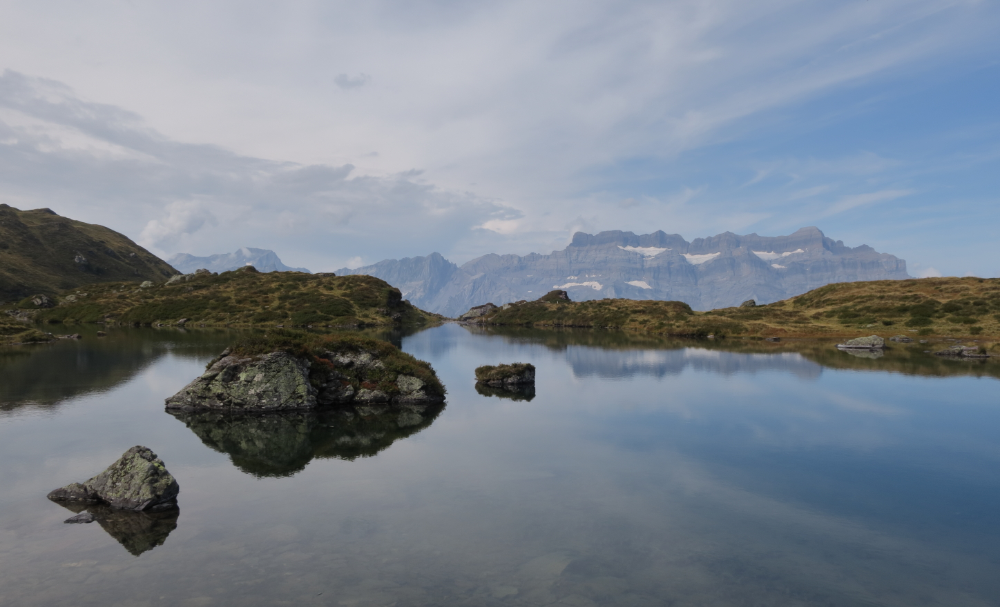
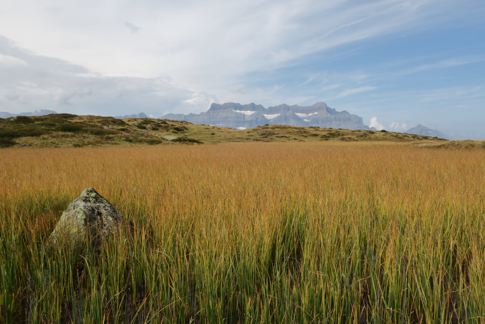
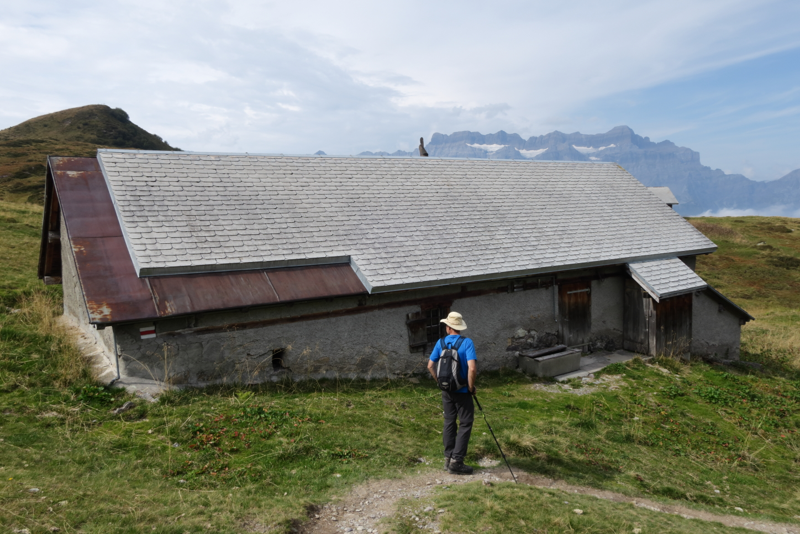
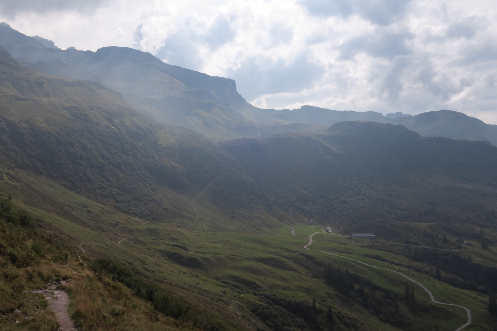

<link href="../../../style.css" rel="stylesheet"></link>

| Difficulty | [T2](../overview/#wanderskala) |
| :--- | :--- |
| &#8644; Distance | 11.7 km |
| &#8593; Up | 790 m |
| &#8595; Down | 790 m |
| Notable Locations | Kies Cable Car, Stausee Garichti, Chärpfbrugg, Leglerhütte SAC, Ratzmatt |
| Public Transit Access? | Yes |
<!-- | Map Download | [PDF](.pdf), [GPX](.gpx) | -->


{}

## Quick Summary

- Took the cable car from <hl>Kies (Talstation)</hl> to the <hl>Stausee Garichti</hl>
  - Can access the cable car either via bus or by car; a decent amount of parking space available here
- Follow the gravel road to Nideren near the <hl>Chärpfbrugg</hl> caves
- Continue following the regular hiking path to the south of the Sunnenberg
- Path leads directly to the <hl>Leglerhütte SAC</hl>
- After a quick lunch, we took the (relatively steep) western path from the hut towards the <hl>Chammseeli</hl>
- Continued north-east from the Chammseeli towards <hl>Ratzmatt</hl>
- Went over the saddle at <hl>Matzlenfurggelen</hl> and then back down to the cable car station at the <hl>Stausee Garichti</hl>

{}
{}

{}

{}

{}
{}

## Ascent via the Chärpfbrugg

 looking north again towards Glarus.  This is (roughly) the highest point of the hike.")

## Leglerhütte and Return via Ratzmatt

 and then continued over this saddle to the lake on the right-hand-side of the image.")

{}
{}



{}

