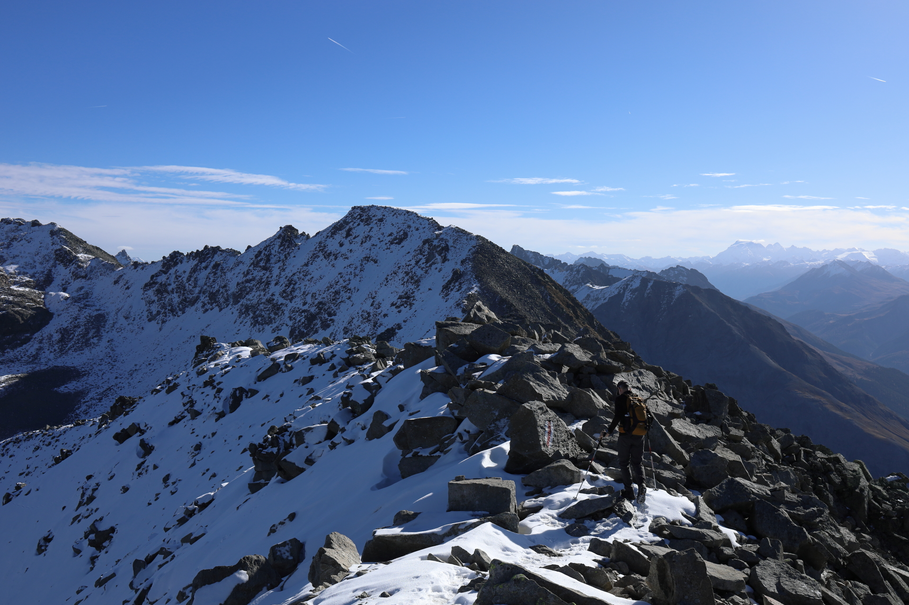

<link href="../../../style.css" rel="stylesheet"></link>

| Difficulty | [T3](../overview/#wanderskala) |
| :--- | :--- |
| &#8644; Distance | 15.8 km |
| &#8593; Up | 740 m |
| &#8595; Down | 1570 m |
| Notable Locations | Zernez, Munt Baselgia, Spi da Baselgia, Swiss National Park, Macun Seen, Lavin |
| Public Transit Access? | Yes[^1] |


{}

## Quick Summary

- Hike in the upper <hl>Engadin</hl> from <hl>Zernez</hl> to <hl>Lavin</hl>.
- We took the <hl>Macun Shuttle</hl> part way up <hl>Munt Baselgia</hl>.
  - Driving up this mountain road was not permitted when we were there — taking the alp taxi was the only way up apart from walking.
- Hiked from the drop-off location up to the <hl>Spi da Baselgia</hl> (highest point of the hike).
  - Incredible view down into the <hl>national park</hl> where the <hl>Macun Seen</hl> (lakes) were.
  - Stopped here for a brief lunch.
- Continued down over the easter ridge of the <hl>Spi da Baselgia</hl> and descended into the park to the north.
  - The first portion of the descent was extremely precarious due to recent snowfall.
- There were very few larches in the national park here given the elevation.
- Continued down towards <hl>Lavin</hl>.

{}
{}

{}

{}

{}
{}



{}


[^1]: There was an alp taxi (the <hl>Macun Shuttle</hl>) that we took from <hl>Zernez</hl> up the winding road part way up <hl>Munt Baselgia</hl>.  However, this was not part of the standard SBB timetable and had to be reserved in advance.