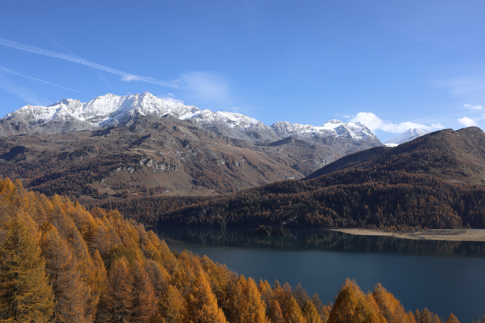

<link href="../../../style.css" rel="stylesheet"></link>

| Difficulty | [T2](../overview/#wanderskala) |
| :--- | :--- |
| &#8644; Distance | 13.4 km |
| &#8593; Up | 640 m |
| &#8595; Down | 640 m |
| Notable Locations | Sils im Engadin, Muotta Radonda |
| Public Transit Access? | Yes |


{}

## Quick Summary

- An autumn hike among the <hl>larches</hl> in the <hl>Engadin</hl> about half way between <hl>Maloja</hl> and <hl>Silvaplana</hl>.
- Drove to <hl>Sils im Engadin</hl> and parked in a small parking lot just off of the main road.
  - There was also a nearby PostAuto stop.
- Our initial plan was to take the PostAuto from <hl>Sils/Segl Baselgia, San Lurench</hl> to <hl>Maloja, Capolago</hl>
  - We ended up narrowly missing the bus so we decided to hike from <hl>Sils</hl> towards <hl>Maloja</hl> instead
- Instead of hiking all the way to <hl>Lägh dal Lunghin</hl>, we instead <hl>turned around</hl> after a short lunch break at the top of the <hl>Muotta Radonda</hl> and returned the same way we initially came.
- There were two main motivating factors why we returned back the same way we came:
  1. The descent from <hl>Lägh dal Lunghin</hl> to <hl>Maloja</hl> was quite steep.
  2. There seemed to be a greater density of larches along the path we came from.
- Definitely the highlight of the hike was the incredible number of larch trees close to Sils.

{}
{}

{}

{}

{}
{}



{}
