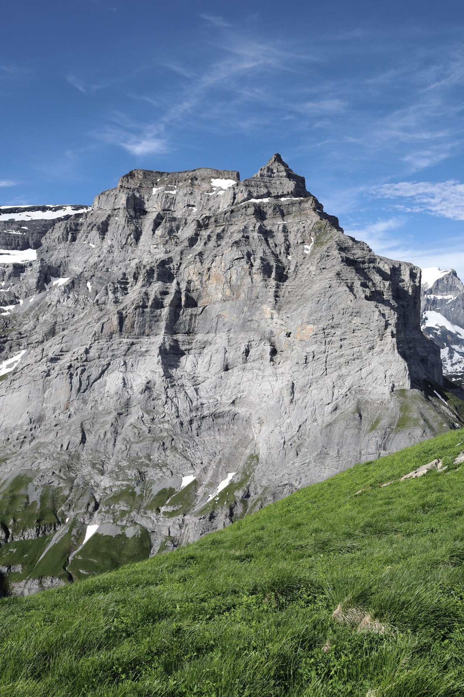
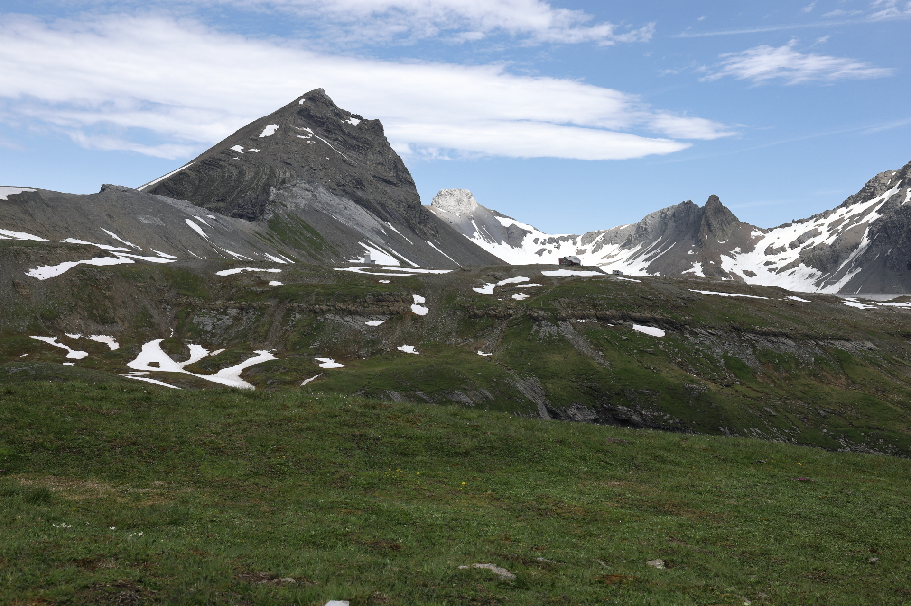
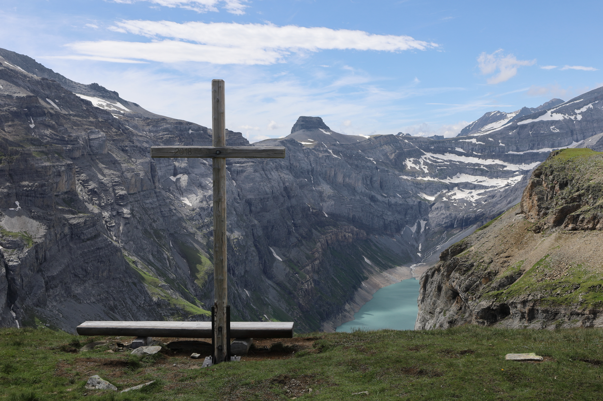

<link href="../../../style.css" rel="stylesheet"></link>

---

## Summer 2021

| Difficulty | [T3](../overview/#wanderskala) |
| :--- | :--- |
| &#8644; Distance | 11.2 km |
| &#8593; Up | 730 m |
| &#8595; Down | 730 m |
| Notable Locations | Tierfed, Kalktrittli, Muttseehütte SAC, Muttenchopf, Limmerensee |
| Public Transit Access? | No |


{}

## Quick Summary

- Took a (completely over-engineered) cable car from <hl>Tierfed</hl> to <hl>Kalktrittli</hl>.
- From <hl>Kalktrittli</hl> we took the newly constructed path which had been blown out of the side of the mountain.
  - While the path is quite wide and very well maintained, it is <hl>extremely</hl> exposed (near-vertical drop of around 800 m).
- Hiked up towards the <hl>Muttenwändli</hl> via the <hl>Nüschentäli</hl>.
  - We had a few small snowfields to cross despite it being mid-summer.
- Coffee and Wähe at the <hl>Muttseehütte SAC</hl>.
- Quick pit-stop on the <hl>Muttenchopf</hl>.
- Descent to the <hl>Limmerensee</hl>.
- Return via the <hl>access tunnel</hl> used for constructing the dams at the Limmerensee and the Muttsee.

{}
{}

{}

{}

{}
{}

## Kalktrittli

")

 goes up along a newly constructed path to the <hl>Nüschentäli</hl> while the second goes through an access tunnel that leads directly though the mountain.  We'll be taking the access tunnel on the way back.")

## Nüschentäli to the Muttseehütte

.  According to the topography map, it would be around an 800 m drop if we were to fall here.  We definitely had to watch our step.")

.")

 is just out of frame on the right-hand-side.")

## Muttenchopf and the Limmerensee

.")

.  That approach would likely make for a good family outing on a weekend.")

## Return Through the Access Tunnel
<hl>NOTE: We were REQUIRED to wear a safety vest through the tunnel.  There was a box with a bunch of them at the door leading into the tunnel; we took one from this bin and then deposited it back in the box at the other end of the tunnel.</hl>

{}
{}



{}


---

## Autumn 2022

| Difficulty | [T3](../overview/#wanderskala) |
| :--- | :--- |
| &#8644; Distance | 16.8 km |
| &#8593; Up | 730 m |
| &#8595; Down | 1820 m |
| Notable Locations | Tierfed, Kalktrittli, Muttseehütte SAC, Muttenchopf, Limmerensee, Tierfed |
| Public Transit Access? | No |


{}

## Quick Summary

- Beautiful autumn hike to the <hl>Muttseehütte SAC</hl>.
  - Planned to take the same path as in 2021.
- Upon returning to the cable car at <hl>Kalktrittli</hl>, we were informed that the cable car was closed for the rest of the day due to <hl>high winds</hl>.
  - Had to hike down from <hl>Kalktrittli</hl> to <hl>Tierfed</hl>.
- Much of the decent from <hl>Kalktrittli</hl> was through the forest which was quite scenic given the <hl>autumn leaves</hl>.

{}
{}

{}

{}

{}
{}



{}
