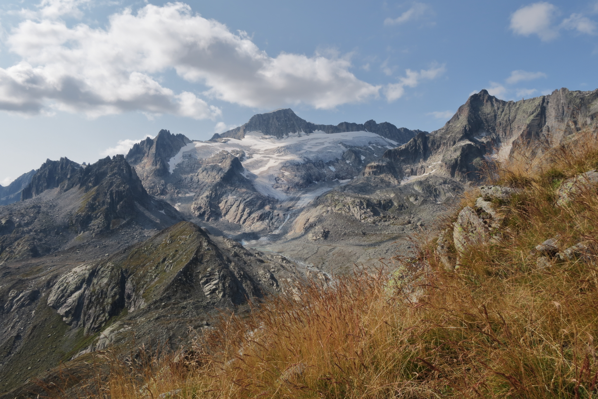

<link href="../../../style.css" rel="stylesheet"></link>

| Difficulty | [T3+](../overview/#wanderskala) |
| :--- | :--- |
| &#8644; Distance | 10.8 km |
| &#8593; Up | 350 m |
| &#8595; Down | 670 m |
| Notable Locations | Furkapass, Sidelenhütte SAC, Nepali Highway, Albert-Heim Hütte SAC, Schafberg, Tiefenbach |
| Public Transit Access? | Yes |


{}

## Quick Summary

- A gorgeous hike near the <hl>Furkapass</hl>.
- Parked the car near <hl>Tiefenbach</hl>, which is close to the top of the <hl>Furkapass</hl>.
  - Took the PostAuto from "<hl>Tiefenbach (Furka)</hl>" up to the stop "<hl>Furkapass, Hotel Furkablick</hl>".
- Hiked from the <hl>Furkapass</hl> to the <hl>Sidelenhütte SAC</hl>.
- Took the Blue-White-Blue marked path known as the "<hl>Nepali Highway</hl>" to the base of the <hl>Tiefengletscher</hl>.
- After a stop at the lake at the terminus of the <hl>Tiefengletscher</hl>, we hiked to the <hl>Albert-Heim Hütte SAC</hl>.
- Continued to the top of the <hl>Schafberg</hl>.
  - Descended down the southern ridge of the <hl>Schafberg</hl> to <hl>Schluechtbiel</hl>.
- Walked back along the gravel road to the parking lot near <hl>Tiefenbach</hl>.

{}
{}

## Coming soon...

{}
{}

## Sidelenhütte SAC

 

## Nepali Highway

## Tiefengletscher and the Albert-Heim Hütte SAC

## Schafberg and Return to Tiefenbach

.")

{}
{}



{}
