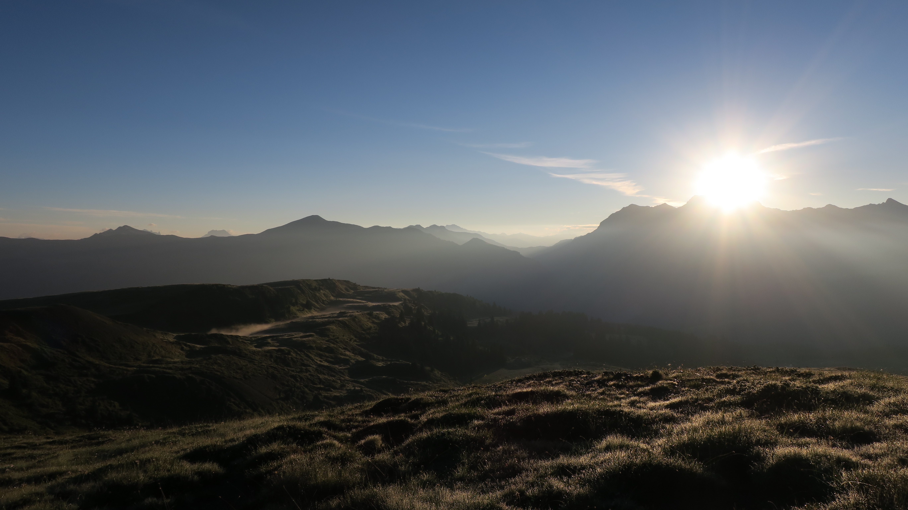
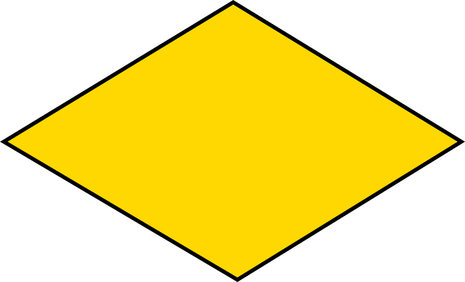
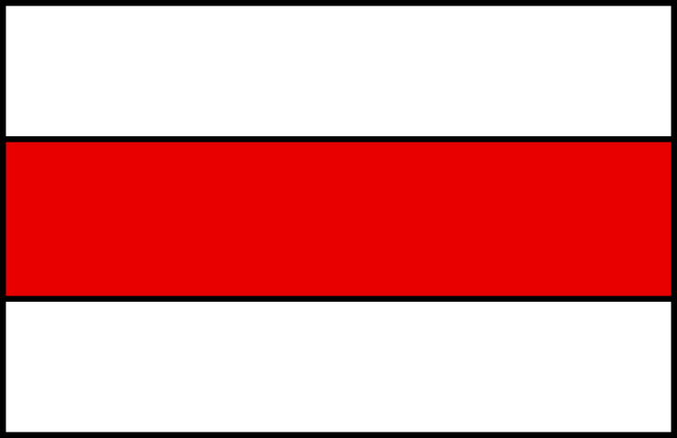
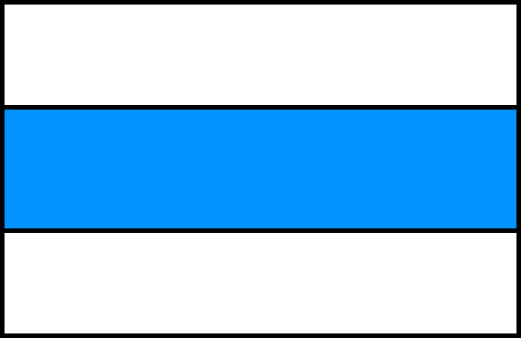

<link href="../../../style.css" rel="stylesheet"></link>

## Welcome!

Here you'll find a compilation of hikes from in and around Switzerland.  We've
done our best to include details such as:

  - Distance and approximate walking times
  - Difficulty rating
  - Photos
  - Maps

## A Word of Caution

Keep in mind that in case you choose to undertake any of the hikes listed on this
website, you do so at your own risk.[^1]  While hiking is generally regarded as a
laid back and relaxing sport, severe injury or even death are never out of the
question when navigating in the mountains.  

In short: know your limits, do your research, and use your brain.

## Swiss Alpine Club (SAC) Difficulty Ratings {#wanderskala}

There's a whole zoo of different difficulty rating systems depending on the
sport (hiking, climbing, mountaineering, etc) and the country you're in.  One of
the main ones that's used in Switzerland for designating the difficulties for
hiking trails are the so-called "SAC Berg- und Alpinwanderskala" which roughly
translates to "SAC Mountain and Alpine Hiking Scale"; this is a scale from T1
(easiest) to T6 (most difficult).  Routes listed with a "+" indicate tours which
are above an average level of difficulty for that class (so a T4+ is more
difficult than a T4, but not quite in T5 territory yet).

Below is a rough English translation of what each of these difficulty levels
entails.[^2]  For full details, check out the original SAC difficulty
designations
[here](https://www.sac-cas.ch/fileadmin/Ausbildung_und_Wissen/Tourenplanung/Schwierigkeitsskala/Wanderskala-SAC.pdf).

| Difficulty | Characteristics | Requirements |
| :---: | :--- | :--- |
| <hl>T1 Hike</hl>  | <ul><li>Well constructed path/road</li><li>If present, exposed sections are very well secured</li><li>Danger of falling is under normal circumstances very minimal</li></ul> | <ul><li>Basic mobility</li><li>Running shoes are suitable</li><li>Navigation is unproblematic</li></ul> |
| <hl>T2 Mountain Hike</hl>  | <ul><li>Trail with continuous path</li><li>Terrain is partly steep</li><li>Danger of falls not out of the question</li></ul> | <ul><li>Somewhat surefooted</li><li>Trekking shoes recommended</li><li>Elementary navigation skills</li></ul> |
| <hl>T3 Difficult Mountain Hike</hl>  | <ul><li>Path not necessarily continuously visible</li><li>Exposed areas can be secured with ropes or chains</li><li>May need hands for balance</li><li>Some exposed areas with danger of falls</li><li>Scree plains</li></ul> | <ul><li>Surefooted</li><li>Good trekking shoes</li><li>Average orientation skills</li><li>Elementary alpine experience</li></ul> |
| <hl>T4 Alpine Hike</hl>  | <ul><li>Potentially pathless</li><li>May need hands to traverse certain passages</li><li>Terrain is quite exposed and can contain steep grass slopes, crags, simple firn fields, and snowy glacier passages.</li></ul> | <ul><li>Familiar with exposed terrain</li><li>Sturdy trekking shoes</li><li>Strong terrain assessment and orientation skills</li><li>Alpine experience</li><li>If weather changes, it can be difficult to retreat</li></ul> |
| <hl>T5 Difficult Alpine Hike</hl>  | <ul><li>Often pathless</li><li>Contain some easy climbing passages</li><li>Exposed and demanding terrain</li><li>Firn fields and glacier passages with increased exposure</li></ul> | <ul><li>Experience in high alpine terrain</li><li>Mountaineering boots</li><li>Very good terrain assessment and orientation skills</li><li>Basic knowledge of handling of ice axes and rope</li></ul> |
| 
<hl>T6 Very Difficult Alpine Hike</hl>
 
(Generally not marked)
 | <ul><li>Normally pathless</li><li>Moderately difficult climbing sections</li><li>Often extremely exposed</li><li>Precarious ridge passages</li><li>Glacier passages with increased exposure</li></ul> | <ul><li>Extensive high alpine experience</li><li>Excellent navigation skills</li><li>Experienced with various mountaineering tools</li></ul> |

These difficulty ratings assume that the tour is performed <hl>under optimal conditions</hl>.  This means things like:
  - Good weather
  - Dry terrain
  - Good snow conditions
  - Etc.

A common misconception is that T5 or T6 hikes are less difficult than "easy"
high alpine tours (these use a different difficulty scale).  Many T5 or T6
tours have little to no opportunities to secure oneself the way one may be
able to on easier high alpine routes <hl>which makes it imperative that one
has absolute mastery over alpine environments</hl>.  Typical examples of such
terrains include extremely steep grass slopes, unmarked routes along unstable
scree slopes, or very exposed ridge traverses.  Due to the different
attributes which are used to characterize high alpine routes and hiking
trails, there is certainly overlap in terms of "absolute difficulty" between
both hiking and high alpine tours.

## Some Useful (Mostly German) Geographic Words to Know

There are a lot of words that you'll likely come across when people list the names
of different places in the mountains.  Here are a few common terms/prefixes that might
be useful to know:
- <hl>Canton</hl>: The Swiss version of a "state" or a "province".
- <hl>&#65343;horn</hl>: A type of pyramid shaped mountain; usually with 3 or 4 distinct faces.  Formed through glacial erosion on each face, so they're usually at fairly high elevations.
- <hl>Piz &#65343;</hl>: Similar meaning to "horn"; typically used in the Canton of Graubünden (eastern Switzerland)
- <hl>&#65343;stock</hl>: Another name for a certain peak; are usually (but not always) at lower elevations than horns.
- <hl>&#65343;spitz</hl>: Literally means "point"; does not really give an indication to how high the mountain is.
- <hl>&#65343;joch</hl>: A saddle or gully between two peaks.
- <hl>&#65343;pass</hl>: Usually a road that connects two valleys.  These often serve as connection points to go from one Canton to another.
- <hl>&#65343;grat</hl>: Means "ridge".
- <hl>&#65343;tal</hl>: Means "valley".
- <hl>&#65343;gletscher</hl>: Means "glacier".
- <hl>&#65343;firn</hl>: Snow that stays all-year round without melting but has not yet turned to ice to form a glacier.
- <hl>&#65343;see</hl>: Means "lake".
- <hl>&#65343;hütte SAC</hl>: "Hütte" means "hut" and "SAC" stands for "Swiss Alpine Club"; you can stay overnight at these.  The food they provide is usually awesome as well.  10/10 would recommend.

[^1]: See [here](/disclaimer).
[^2]: These difficulty ratings are in reference to the September 5, 2012 version of the SAC hiking skala.
