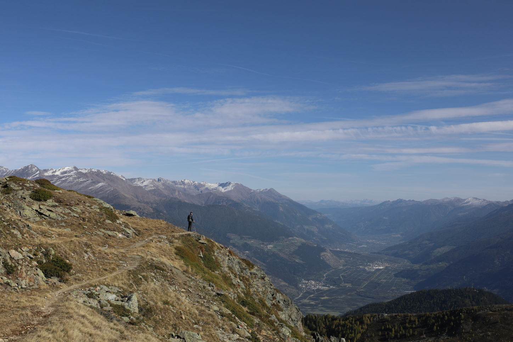
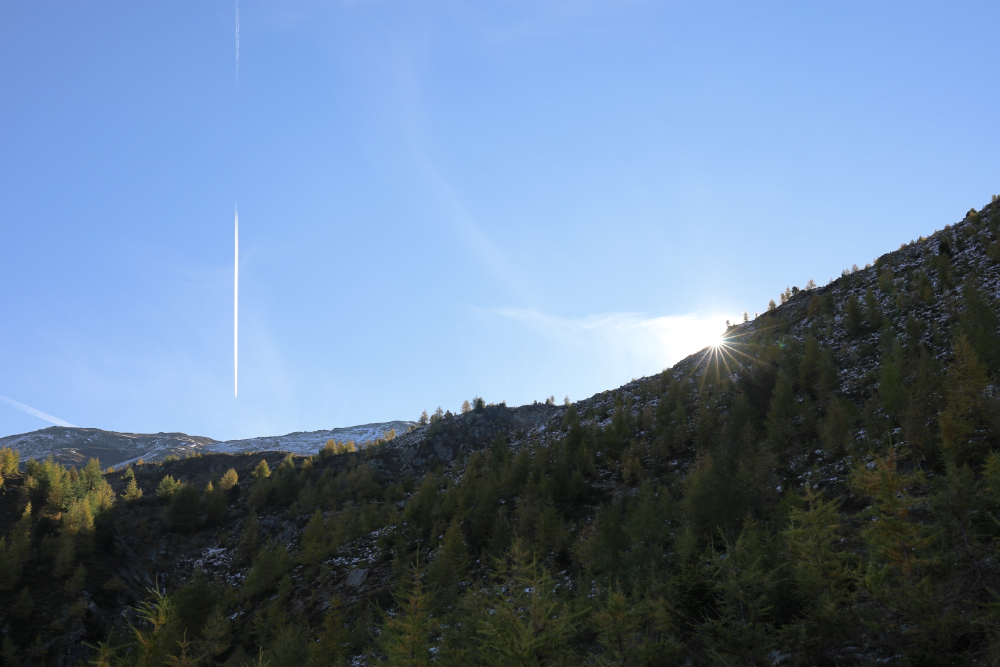
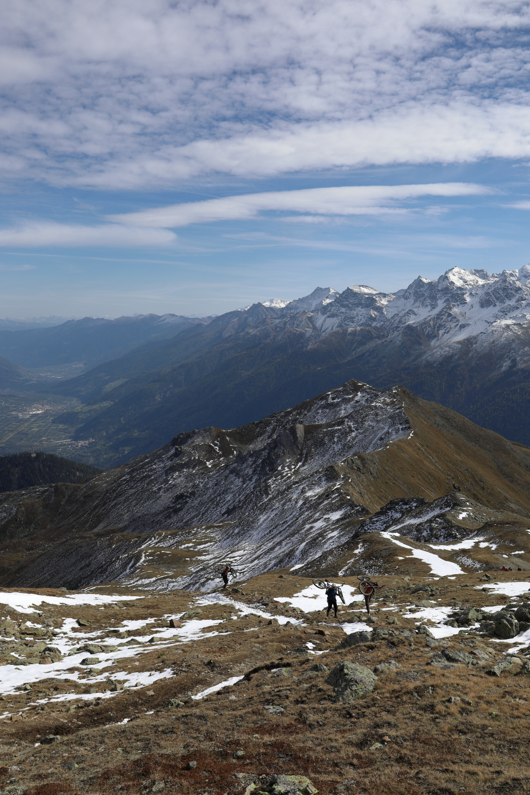
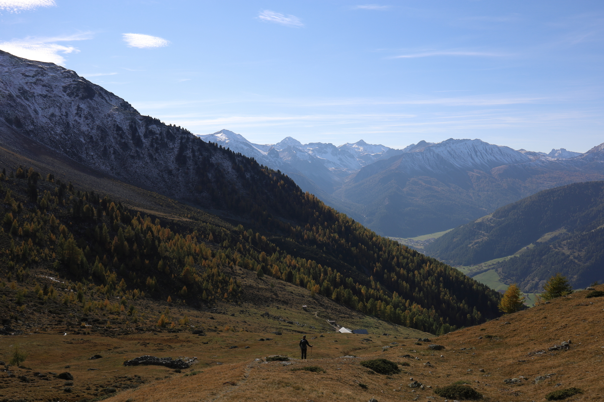
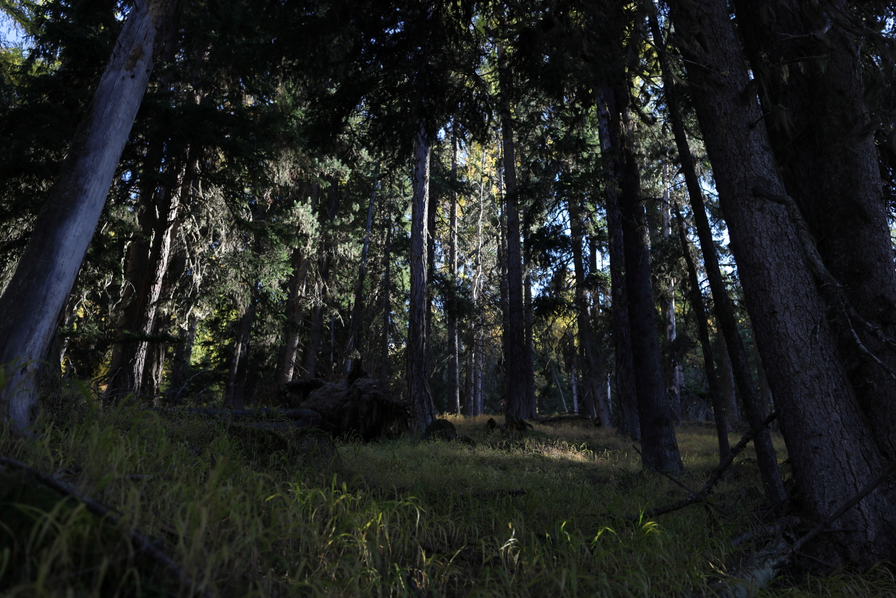

<link href="../../../style.css" rel="stylesheet"></link>

| Difficulty | [T3](../overview/#wanderskala) |
| :--- | :--- |
| &#8644; Distance | 13.8 km |
| &#8593; Up | 1200 m |
| &#8595; Down | 1200 m |
| Notable Locations | Piz Chavalatsch, Stelvio National Park, Sta. Maria (Val Müstair) |
| Public Transit Access? | No |


{}

## Quick Summary

- A fairly long hike on the Swiss/Italian border in the <hl>Val Müstair</hl>
- An abundance of <hl>larch trees</hl> made this an incredible hike to do in the autumn
- We were staying in <hl>Sta. Maria</hl> which was only about a ~5 minute drive to the start of the trail
- Lots of amazing panorama views from the ridges to/from the Piz Chavalatsch

{}
{}

## Coming soon...

{}
{}

## Arrival

We stayed in the <hl>Hotel Alpina</hl> in the village of <hl>Sta. Maria</hl> having arrived the evening before.  The drive to the starting point of this hike only took around 10 minutes from Sta. Maria which made this quite convenient to access.  The road leading up to the starting point was labelled as an "off-road" route but there was indeed small parking lot at the end of the road (I'd say there's probably room for about 5 or 6 cars).

## Ascent Among the Larches

The first part of the hike consists of hiking through the forest among the larch trees.  For the uninitiated, larch trees are conifer trees that turn bright yellow in the autumn.  This only happens for a very short period of time in the autumn; the needles fall off of the larch trees not too long after they turn yellow.

The colours hiking up through the forest for this part of the trail was absolutely incredible — this kind of trail was the primary reason why we came to this part of Switzerland at this time of year.  Definitely worth seeing if you get an opportunity!

Once we had gotten to a sufficient elevation, we started to peek above the forest and had an absolutely incredible view over the <hl>Val Müstair</hl>.  

Overall, this part of the trail was pretty unproblematic.  The elevation gain was pretty consistent and there weren't any exposed spots.  Since this part of the hike was pretty much all in the shade, much of the ground was still frozen from the cold evening before.

## Ascent to the Piz Chavalatsch

The next part of the hike first went across a flat plain just above the treeline.  Most of the grass here had already turned orange/yellow which really complemented well with the colour of the larches below us.

The elevation gain here continued at a somewhat similar pace to the first part of the hike — nothing too crazy but just consistently upwards.  As we started getting a little further up, we started hitting the occasional snow field, but none of these really impeded our progress.

Once we had gotten to the final ridgeline up to the <hl>Piz Chavalatsch</hl>, we were greeted by an absolutely incredible view across the alps to the south.  The peak of the <hl>Ortler</hl> was particularly impressive with its impenetrable glacier leading down from the summer.  Also interesting that we could see the groomed *summer* skiing slopes near the Stelvio pass.

.")

The final ascent up to the <hl>Piz Chavalatsch</hl> was again generally unproblematic.  This final part of the ridgeline was perhaps a little steeper than the previous sections, but was generally not exposed.  Since this ridge was also south-facing, it was (almost) completely free of snow.

Once at the top, we were met with an insane 360 degree panorama over the surrounding region.  There's a small hut at the top which had a couple of benches that we could relax and have a picnic at.  All things considered, it was fairly empty at the summit with only around 4 or 5 other people also hanging around taking pictures and enjoying the awesome weather.

    

        

            
            <em>The southern ridge leading down towards Italy.  These brave souls were carrying their bikes up through the snow.</em>
        

    

    

        

            
            <em>The eastern ridge along the Swiss-Italian border.  This is the ridge we would head down next.</em>
        

    

## Descent and Ridge Crossing to the Rifairscharte

After a quick lunch, we headed down across the ridge on the north side of the Piz Chavalatsch into the <hl>Stelvio National Park</hl>.  Since the ridge is on the north side of the peak, we had to make our way through a few knee-deep snow patches shortly after departing from the peak.

There wasn't much in the way of elevation changes across the ridge which made this part of the hike a welcome change from the steady ascent up to the top of the Piz Chavalatsch.  We had an incredible view into Switzerland in the west and Italy in the east.

.")

We traversed across the ridge until we reached a junction at the <hl>Rifairscharte</hl>; here we headed west back towards the Swiss side.

The portion from the <hl>Rifairscharte</hl> down to the forest was the first part of the hike which wasn't particularly well marked.  We mostly had to rely on our GPS since the trail markers were few and far between.

## Return Through the Forest

I'm normally not particularly fond of hiking through the forest while I'm in the mountains; the views are usually not nearly as impressive as when hiking above the treeline.  This was a clear exception here though — the hike amongst the larches was truly a treat.

We were also lucky to have lighting conditions comparable to golden hour while making our way through the forest despite it only being late afternoon by this point.  The light was just peeking through the trees and was causing some really dramatic shadows between the trees and yellow grasses.

After a beautiful hike through the forest, we had arrived at part of the trail that we took on our way up to the Piz Chavalatsch.  After making our way back through the forest and back to the car, we enjoyed a well deserved rest back at the hotel after the very short drive back to <hl>Sta. Maria</hl>.  A fairly long but very worthwhile tour.

{}
{}



{}
