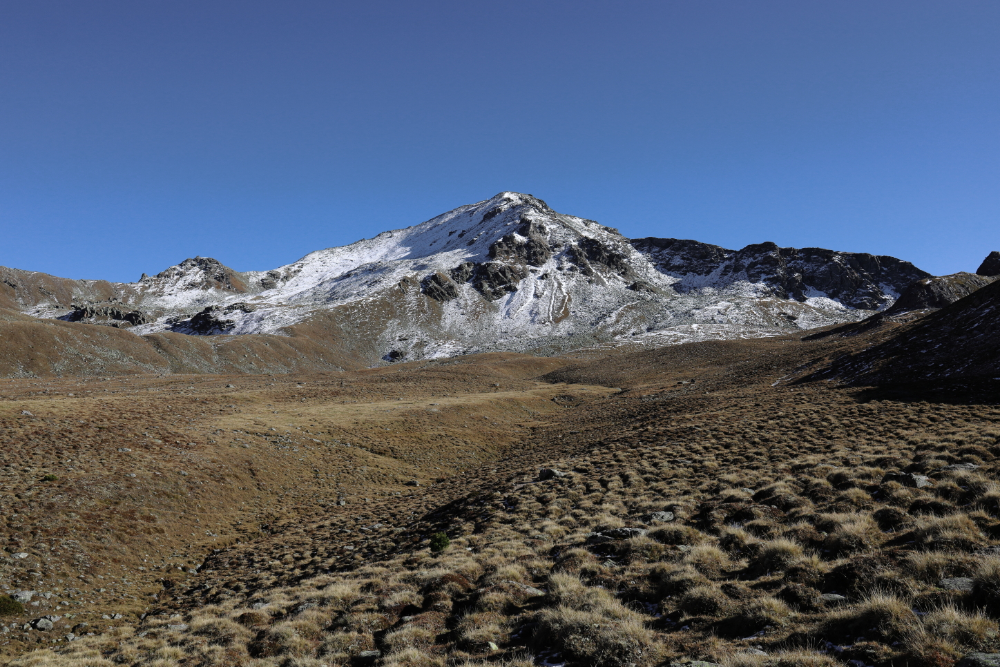
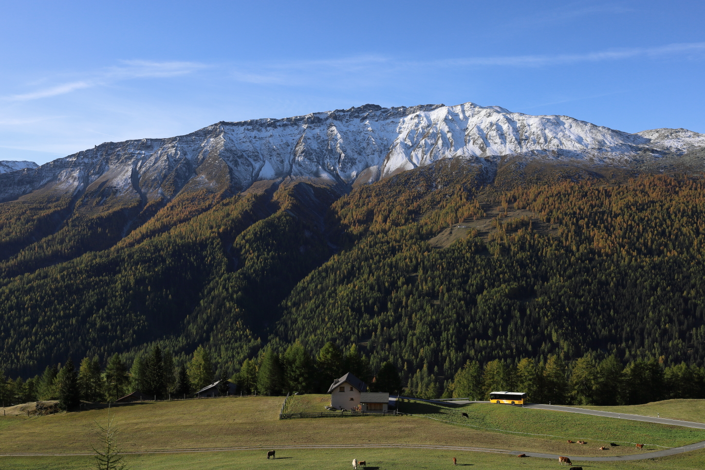
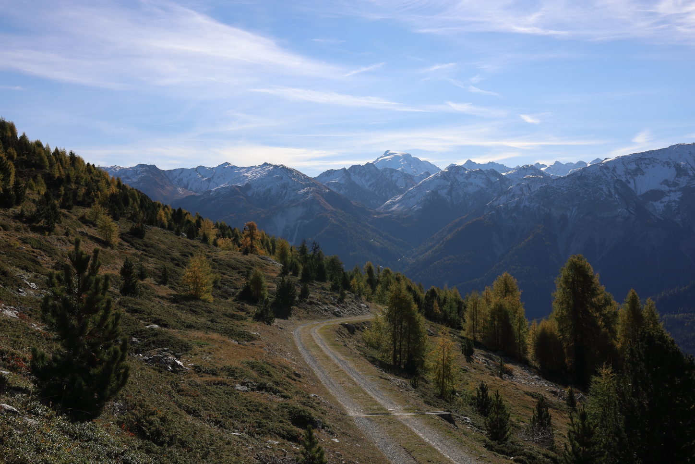
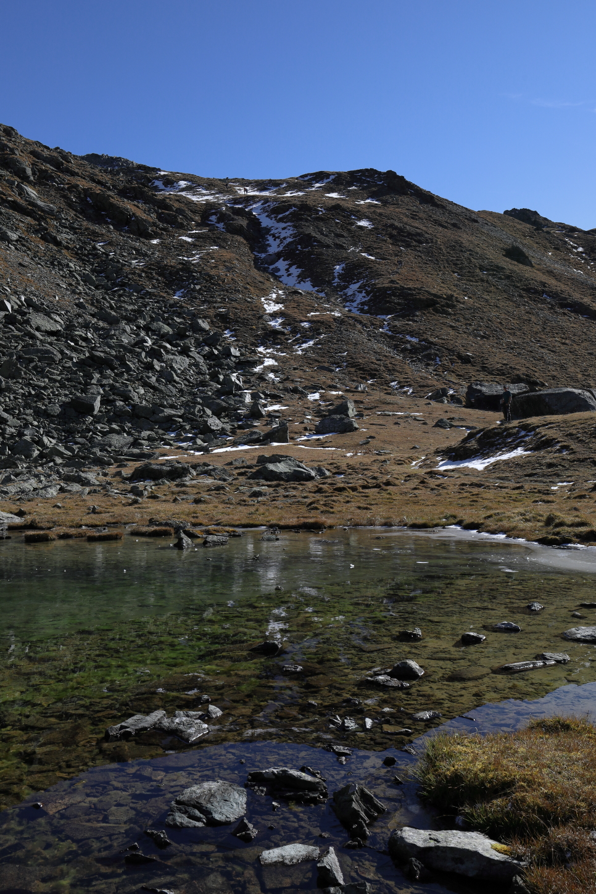
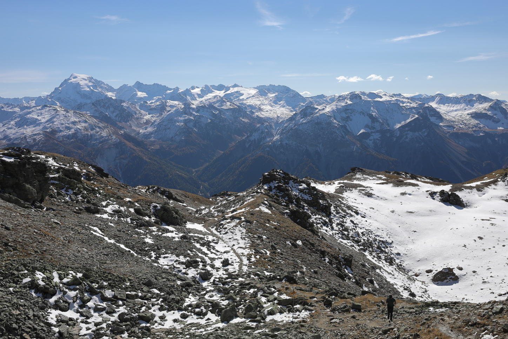
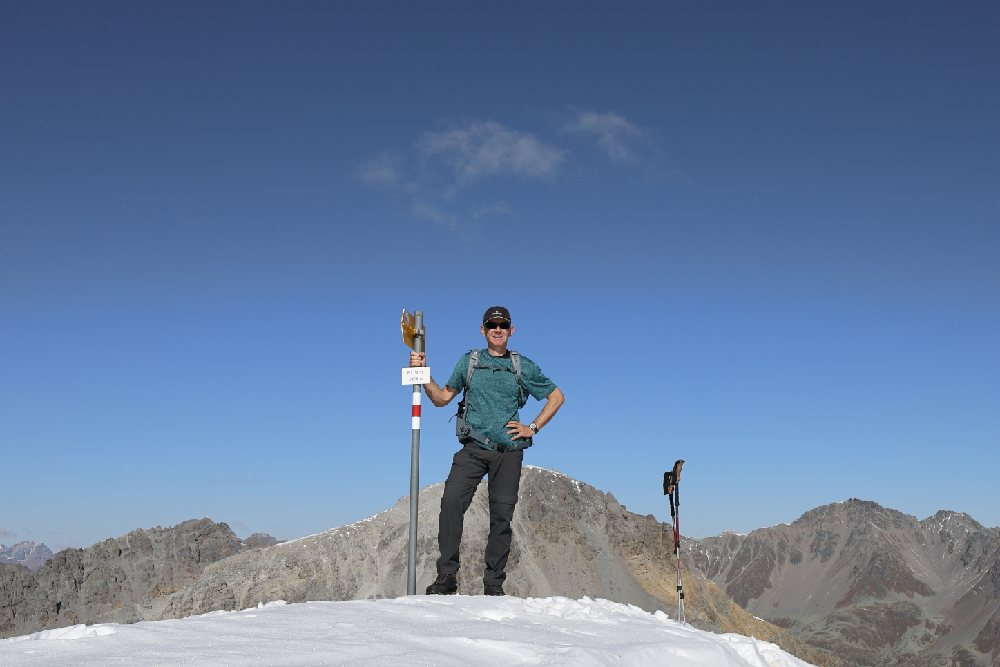
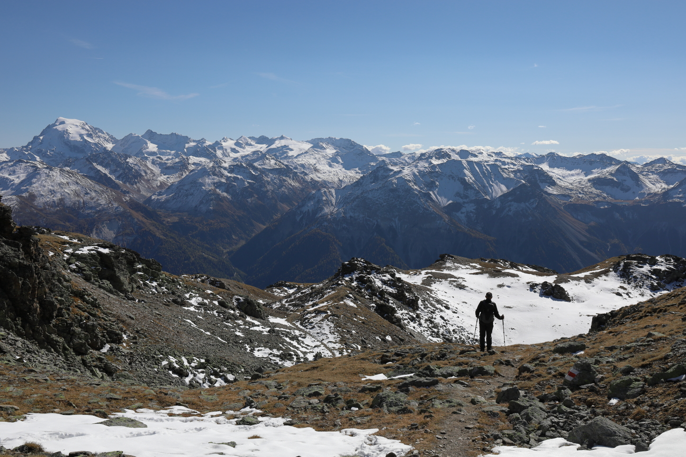
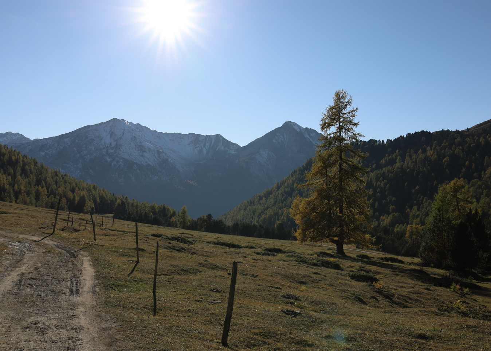
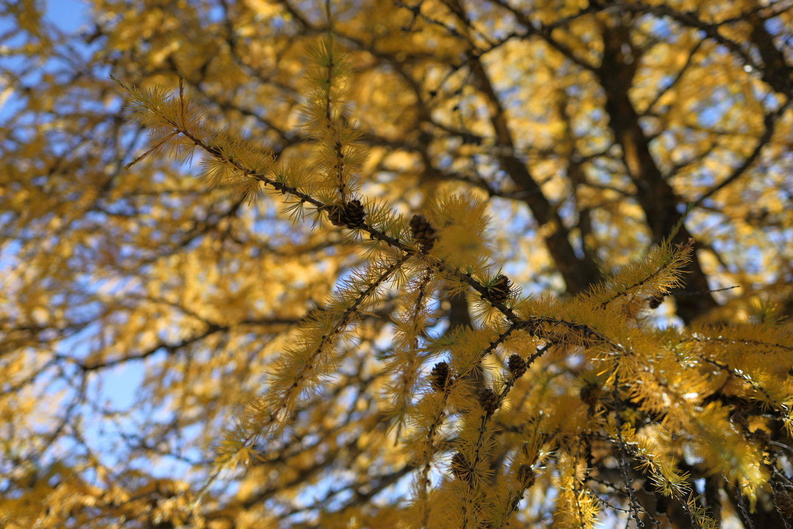
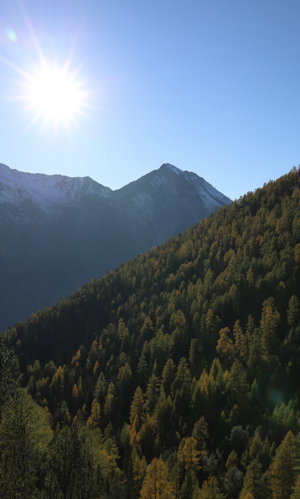

<link href="../../../style.css" rel="stylesheet"></link>

| Difficulty | [T2](../overview/#wanderskala) |
| :--- | :--- |
| &#8644; Distance | 15.9 km |
| &#8593; Up | 940 m |
| &#8595; Down | 940 m |
| Notable Locations | Lü (Val Müstair), Piz Terza |
| Public Transit Access? | Yes |


{}

## Quick Summary

- A fairly lengthy hike from <hl>Lü</hl> to the <hl>Piz Terza</hl> in the <hl>Val Müstair</hl>
- There was a nice mix of relatively chill gravel roads and some steeper hiking paths
- Given the relatively high elevation of the <hl>Piz Terza</hl> (2909 m), the peak had some incredible views of the surrounding mountains
- Beginning/end of the hike goes through a forest filled with <hl>larch trees</hl> which add a ton of colour in the autumn months

{}
{}

## Coming soon...

{}
{}

## Arrival in Lü

We arrived in <hl>Lü</hl> from Sta. Maria by car (about a 10-15 minute drive) and parked
in the relatively large parking lot at the edge of town.  However, Lü is
surprisingly accessible by public transit with regular bus service going
directly to the village itself.

## Alp Tabladatsch

The first portion of the hike was along a gravel road through the forest
— amazing views with the yellow larch trees all around.  We were quite surprised
by how few people were on the trail here despite it being a spot which is so
accessible with public transit.  It was also a weekend when we were here so
we really lucked out with the lack of other hikers on the trail

Pretty much the entire part up to the <hl>Alp Tabladatsch</hl> hut consisted of
very well maintained gravel roads.  It was only once we reached a small alp hut a
stone's throw from Alp Tabladatsch that we reached a more typical hiking path.

, which is to the right of the <hl>Piz Daint</hl> (right peak).")

## Piz Terza

This portion of the hike followed a stream up to a small lake near the <hl>Fuorcla Sassalba</hl>.  Here we followed the waypoint sign to the trail leading up to the <hl>Piz Terza</hl>.

This part of the trail was quite a bit steeper than the previous parts, but was not at all exposed.  The path was well marked and generally unproblematic to traverse apart from a few patches of ice and snow.

.")

We started hitting more frequent snow fields once we got above an elevation of around 2600m to 2700m.  As mentioned though, this path was not at all exposed so these additional obstacles only resulted in the hiking times being a little longer than expected but did not otherwise impact the hike at all.

Once at the top of the <hl>Piz Terza</hl>, we were met with an incredible 360° view of the surrounding mountains.  While the view from yesterday's peak on the <a href="../piz_chavalatsch/">Piz Chavalatsch</a> was impressive, the view from the Piz Terza was on a whole other level.

We took a well deserved break at the summit, had some lunch, and enjoyed the views.

## Fuorcla Sassalba

After a short rest, we made our way back down the same path which we had taken up to the summit.  We followed this path all the way back to the small lake below the <hl>Fuorcla Sassalba</hl> which we came across previously before heading up to the Piz Terza.

Once we had arrived at this small alpine lake, we made our way up to the upper (and slightly larger) lake on the <hl>Fuorcla Sassalba</hl>.  This alpine lake looked pretty unique in that the low seasonal water level had exposed most of the rocks which would normally otherwise be submerged below the surface of the lake.  These rocks were completely covered in black algae, which gave them the appearance of having been set on fire.  Really quite a unique spot.

As expected, we encountered considerably more snow/ice while heading down the north side of the <hl>Fuorcla Sassalba</hl> when compared to our hike up on the south side.  While not a dangerous descent, this definitely did slow us down somewhat.  With that being said, we were met with almost entirely snow-free trails on the plains below the fuorcla which made for some quite pleasant hiking conditions across this flatter portion of the hike.  

We followed these relatively flat plains down the valley towards the treeline.  The regular grass mounds along this plain cast some fairly dramatic shadows in the afternoon sun which made for some relatively nice photographs.

We followed this plain until we reached the <hl>Pass da Costainas</hl>.  The path transitioned here from regular hiking paths back into gravel roads.

## Return to Lü

The final portion of the hike back along the gravel road heading towards <hl>Lü</hl> was mostly among the larch trees (somewhat similar to the hike we did the day before near the <a href="../piz_chavalatsch/">Piz Chavalatsch</a>).

While a little on the longer side, this hike was absolutely beautiful and had the benefit of not being technically challenging.

{}
{}



{}
