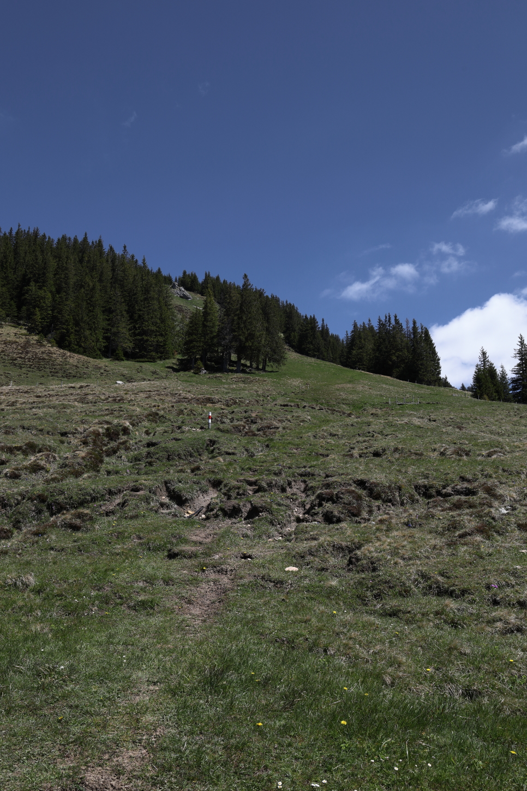

<link href="../../../style.css" rel="stylesheet"></link>

| Difficulty | [T3](../overview/#wanderskala) |
| :--- | :--- |
| &#8644; Distance | 7.6 km |
| &#8593; Up | 690 m |
| &#8595; Down | 690 m |
| Notable Locations | Gründli, Hängst, Schimbrig |
| Public Transit Access? | Yes |
<!-- | Map Download | [PDF](.pdf), [GPX](.gpx) | -->


{}

## Quick Summary

- Relatively short hike up to the <hl>Schimbrig</hl>  in southern Lucerne.
- Took the alpine trail (blue-white-blue) up from <hl>Gründli</hl> to the <hl>Schimbrig</hl>
  - Parking available.
  - Accessible via PostAuto as well.
- We skipped the option to go over the <hl>Hängst</hl> as there is a fairly sketchy scrambling passage ([T4](../overview/#wanderskala)) that connects the Schimbrig to the Hängst.
  - Instead took the path below the south-side of the <hl>Hängst</hl> summit (less exposed)
- Took the regular hiking path to the west of the peak back down to <hl>Gründi</hl> to form a loop.

{}
{}

## Coming soon...

{}
{}

## Ascent to the Schimbrig

.  Most of the lower parts are fairly well marked, but some of the sections higher up required a little more attention to make sure we stayed on the correct path.")

.")

.  Here we opted to follow the official path (left) that leads below the summit of the Hängst.  Part of this section involved crossing the snow field which was by far the sketchiest part of the hike.")

.")

 for the ascent to the Hängst can be seen here on the left; the narrow ridge leading up to the peak has around a 200 m to 300 m drop on both sides.  We decided to skip that one for this time.")

")

## Descent back to Gründli

{}
{}



{}


