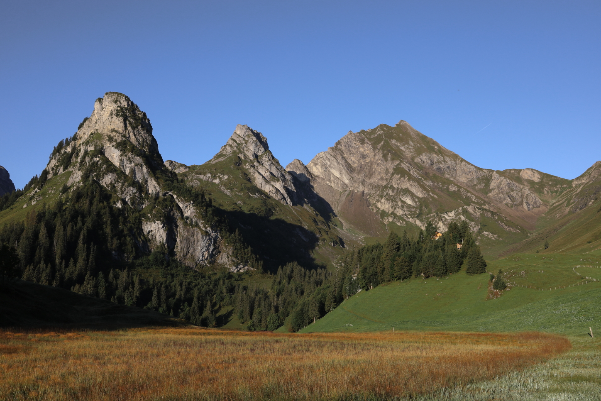
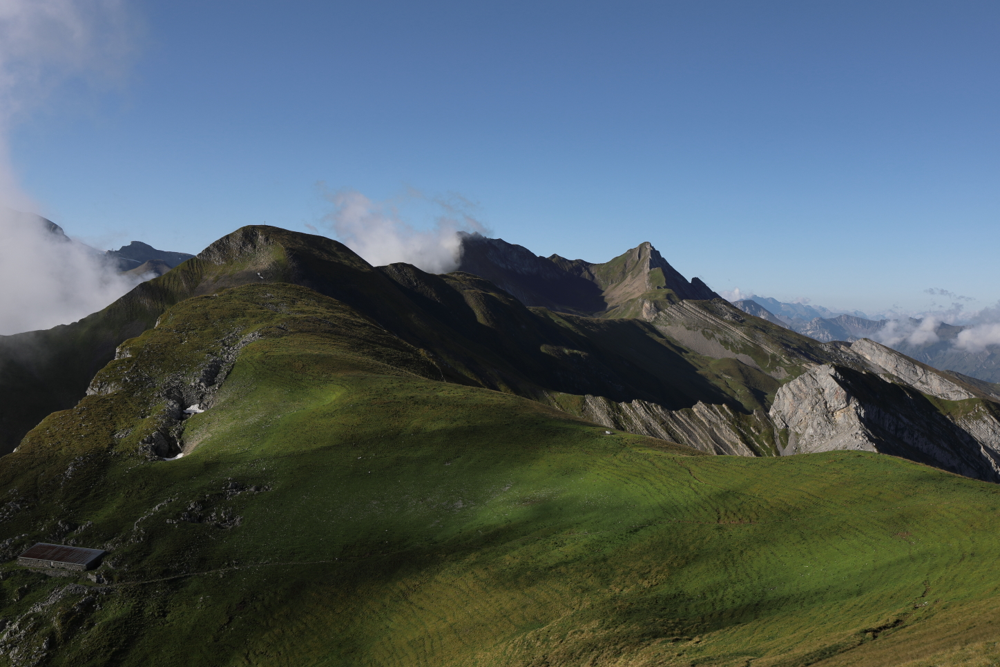

<link href="../../../style.css" rel="stylesheet"></link>

| Difficulty | [T3+](../overview/#wanderskala) |
| :--- | :--- |
| &#8644; Distance | 11.8 km |
| &#8593; Up | 880 m |
| &#8595; Down | 880 m |
| Notable Locations | Schwalmis, Risetenstock |
| Public Transit Access? | Yes |


{}

## Quick Summary

- A hike in the somewhat less-well-known valley of <hl>Isenthal</hl>
- Took a small cable car to the starting point of the hike
- Ascended two main peaks for the day:
    - Schwalmis
    - Risetenstock
- There are a few exposed passages, notably:
    - Traverse over the <hl>Glattgrat</hl> after the <hl>Risetenstock</hl>
    - An extremely narrow path between the <hl>Schuenegg</hl> and the <hl>Steinalper Jochi</hl>

{}
{}

{}

{}

{}
{}

## Arrival

We reached the starting point of the hike via cable car in St. Jakob (end of the
Isenthal).  The cable car station can be reached via public transit by taking a
PostAuto from <hl>Altdorf</hl> to <hl>Isenthal, Seilbahn St. Jakob</hl>.  We
decided to go by car instead though; there is quite a bit of parking space at
the cable car station.

There's a landline telephone in the cable car station that we had to use
to request for the cable car to run — it's a little old-school, but it gets the
job done.  We payed for the cable car ride once we got to the top.

## Schwalmis

The first portion of the hike from the cable car in <hl>Gitschenen</hl> to the <hl>marsh
plain</hl> at Ober Bolgen was fairly straight forward.  There was a fork in the path
about half way across the plain, which was the start of the ascent to the
Schwalmis.  This bit was moderately steep but it was not particularly exposed.

    

        

            
            <em>Marsh plain.</em>
        

    

    

        

            
            <em>Risetenstock.</em>
        

    

After about 150 m of elevation gain, we'd reached the ridge which led to the
<hl>Schwalmis</hl>.  This was the first part of the hike where we needed to be
very careful with our foot placement; slipping here would have be less than
ideal.

We didn't stay at the top for long — it was quite windy and a cloud swept in right as we got to the top.  We still had a nice view over the valley in one direction, but only a wall of fog in the other.

## Risetenstock

The next peak of the day was the <hl>Risetenstock</hl>.  We had to back-track part of the way from the Schwalmis to get back to the path we were on near the marsh plain.

Once we got back to the path near the marsh plain, there were two parallel paths
that led to the <hl>Hinter Jochli</hl>.  We decided to take the one that
was slightly further down into the valley since it seemed considerably less
vulnerable to rockfalls.

The last bit up to the <hl>Risetenstock</hl> was, again, pretty unproblematic.  The path itself was a little bit steep, but was otherwise not exposed.  We stopped for a quick lunch break at the top.

## Glattgrat

The <hl>Glattgrat</hl> (which in German literally means "smooth ridge") was definitely the funnest portion of the hike.  Hiking directly on the ridge meant that the change in elevation was fairly minimal and the views were pretty incredible all the way.  It would have been nice being able to see down into the Isenthal, but having the clouds pushing their way right over the ridge while still having a clear view on the other side of the ridge was pretty mystical.

.")

Something that became apparent pretty quickly was where the Glattgrat gets its
name from — there were quite a few spots with fairly smooth rock sections.
While not normally problematic, we had to be mindful of our footing since all of
the rocks were wet from the fog.

## Steinalper Jochli and Geissboden

While we hadn't seen almost anyone on the path so far, we encountered quite a number of small groups once we got to the <hl>Schuenegg</hl>.  Most of these people seem to have come up from the Brisenhaus SAC hut and had the intention to go to the lookout point on the Brisen.

 and can be seen on the right-hand side of the image.")

The brief traverse from the <hl>Schuenegg</hl> to the <hl>Steinalper Jochi</hl> was by far the most exposed part of the hike.  The path is quite narrow and follows one of the natural rock-bands on the mountain face.  I've drawn the approximate path in below:

 to the Steinalper Jochi (left).")

The hike from here down the valley towards <hl>Geissboden</hl> was pretty chill.
We came across a herd of sheep that were being protected by a few Great Pyrenees
mountain dogs, so we made sure to steer clear of them on our descent.

From Geissboden we followed a gravel road back to <hl>Gitschenen</hl>.  We took
the same cable car back down to return to where we'd parked our car.

{}
{}



{}

