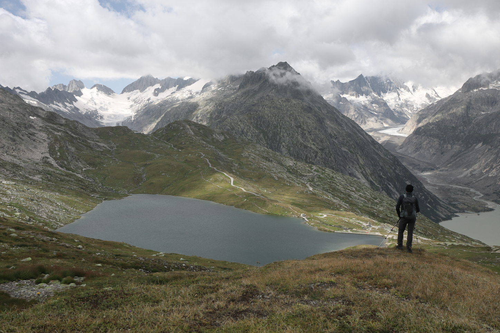

<link href="../../../style.css" rel="stylesheet"></link>

| Difficulty | [T3](../overview/#wanderskala) |
| :--- | :--- |
| &#8644; Distance |  7.7 km |
| &#8593; Up | 700 m |
| &#8595; Down | 700 m |
| Notable Locations | Grimselpass, Sidelhorn |
| Public Transit Access? | Yes |

    


{}

## Quick Summary

- A very foggy hike from the <hl>Grimselpass</hl> to the <hl>Sidelhorn</hl>.
- There is a PostAuto that fairly regularly goes up to the top of the Grimselpass.
  - PostAuto stop <hl>Grimsel Passhöhe</hl>
  - Lots of parking is also available at a number of parking lots close to the top of the pass.
- Generally unproblematic but a few spots were a little sketchy since they were ice covered.
- Incredible panorama with view of:
  - <hl>Grimselpass</hl>
  - <hl>Furkapass</hl>
  - <hl>Oberaarhorn</hl>
  - <hl>Grimselsee</hl> and <hl>Oberaarsee</hl>
  - Probably lots of other places if you visit on a clear day

{}
{}

{}

{}

{}
{}

## A Very Foggy Approach

    
    <em>After a very long discussion in the restaurant at the <hl>Grimsel Passhöhe</hl> about whether to try and tackle the <hl>Sidelhorn</hl> or if we'd be better off going further down into the Wallis where the weather might have been more favourable, we decided to go with our initial plan of ascending the Sidelhorn.</em>

    
    <em>It was extremely foggy for most of the way up to the <hl>Sidelhorn</hl>.  It was only once we got further up that we were able to peek above the clouds.  Luckily the path is very well marked.</em>

    
    <em>A view of the path we'd taken up to the ridge line.  After not having a viewing distance of more than about 10 m for most of the hike, we were finally rewarded with our first glimpses of blue skies once we got further up the ridge line.</em>

    
    <em>Shortly before reaching the final (fairly steep) ascent to the summit, the clouds cleared up seemingly out of nowhere.  Truly a spectacular view down the valley towards the <hl>Oberaarhorn</hl> (still shrouded in the clouds in this picture).</em>

## Sidelhorn

    
    <em>The last bit to the top of the <hl>Sidelhorn</hl> was quite steep but generally not exposed.</em>

    
    <em>Despite it being August, it was very cold up here.  Quite a bit of the path close to the summit was ice covered, which made an otherwise (relatively) easy ascent become a little sketchy.</em>

    
    <em>A view from the summit of the <hl>Sidelhorn</hl>; we had the top of the mountain entirely to ourselves.</em>

    
    <em>View towards the <hl>Nufenenpass</hl> (up the valley but not visible here).</em>

    
    <em>A small window in the clouds let us have a brief view of the <hl>Furkapass</hl> (road on the right side of the image).</em>

## Descent to the Triebteseewli

    
    <em>The descent along the western ridge line towards the <hl>Triebtesee-Licken</hl> required a little bit of scrambling at times, but was not exposed.  The main hindrance we had to watch out for (similar to the ascent) were the sneaky patches of ice on some of the rocks.</em>

    
    <em>A view up the valley after descending from the <hl>Triebtesee-Licken</hl>.  The lake in the foreground is the <hl>Trieteseewli</hl>.</em>

## Return via the Husegghütte

    
    <em>We returned to the <hl>Grimselpass</hl> via a path that was below (but parallel to) the path we took up to the <hl>Sidelhorn</hl>.  Despite being a little icy on the way up, we didn't really hit much in the way of snow apart from a few patches (like this one) that had accumulated in some of the gullies.</em>

    
    <em>This was something we're always careful about regardless of where we're hiking in Switzerland, but especially if there are signs warning us about it.  Luckily we didn't find any UXOs on our hike.</em>

    
    <em>The final descent back to the <hl>Grimselpass</hl>.</em>

{}
{}



{}
