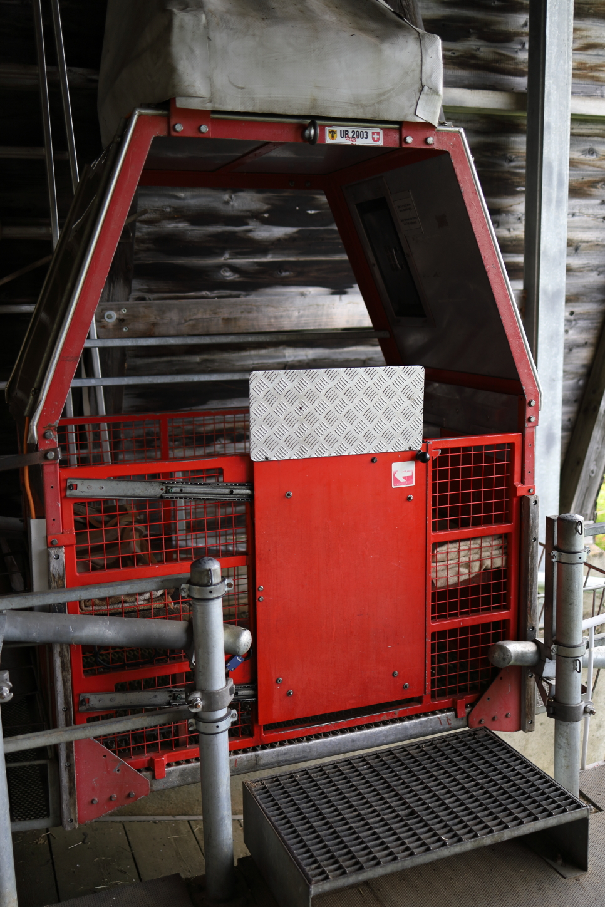
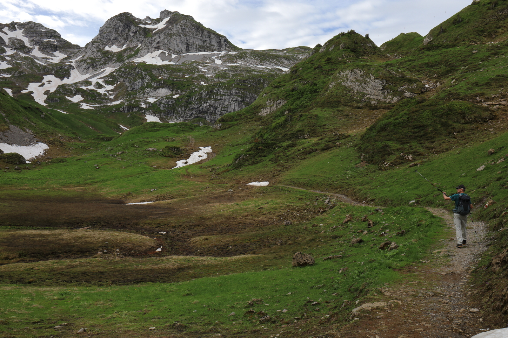
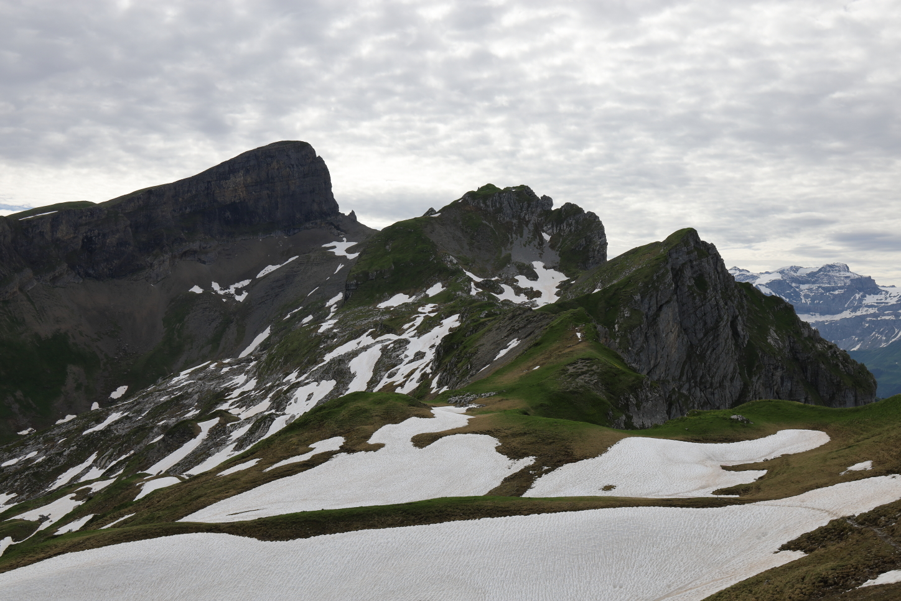
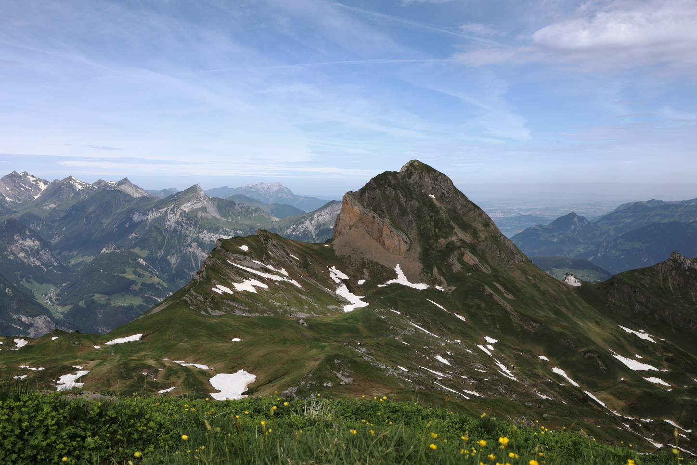
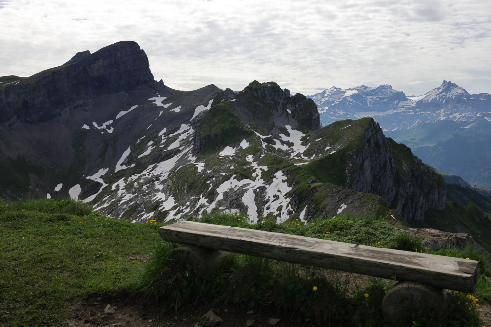
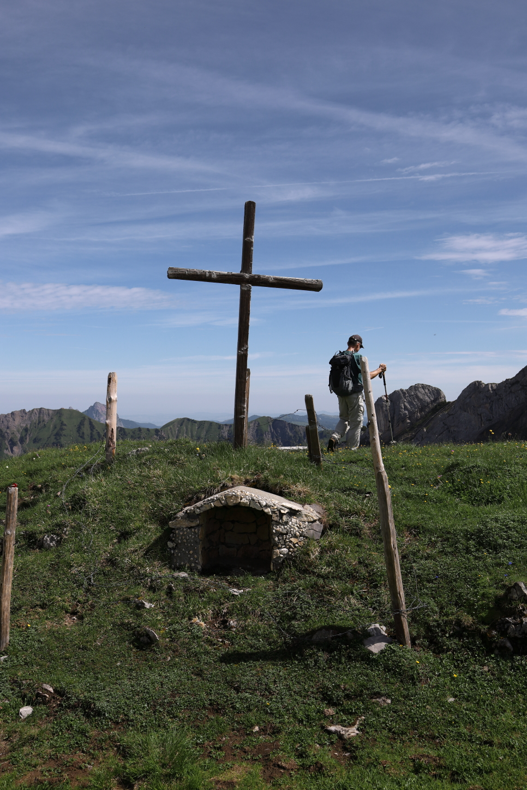
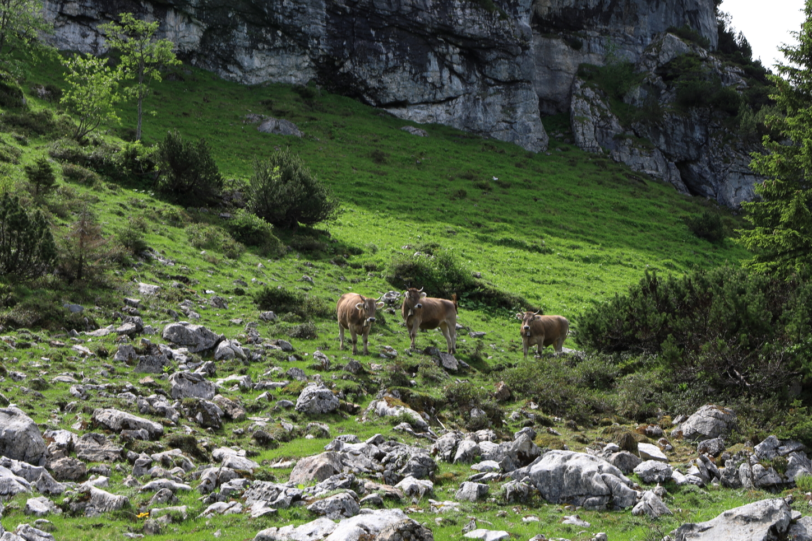
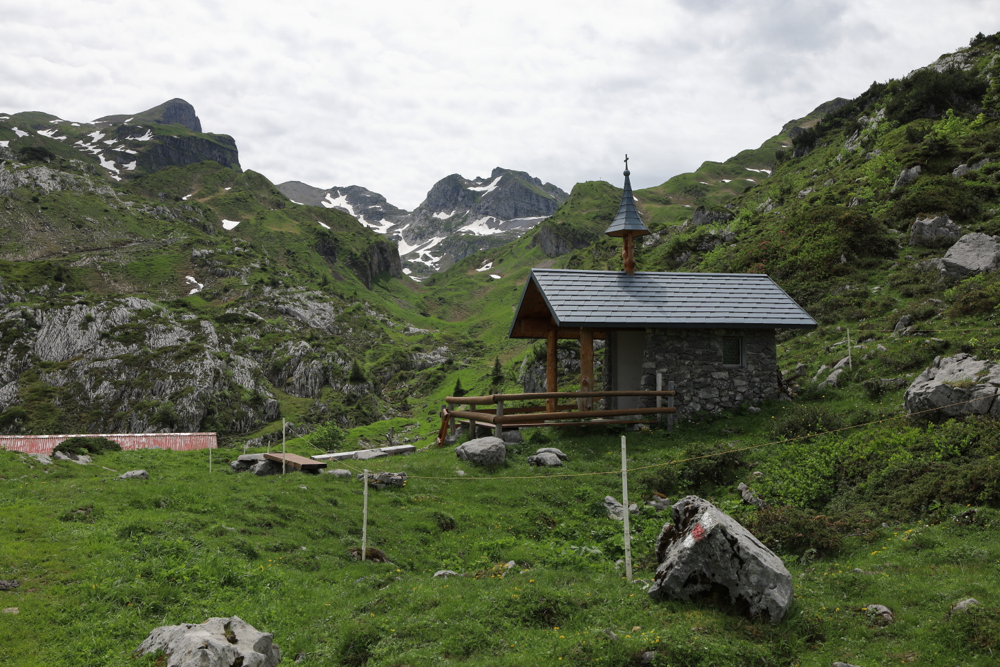

<link href="../../../style.css" rel="stylesheet"></link>

| Difficulty | [T2](../overview/#wanderskala) |
| :--- | :--- |
| &#8644; Distance | 7.8 km |
| &#8593; Up | 420 m |
| &#8595; Down | 420 m |
| Notable Locations | Riemenstalden, Gitschen, Spilauersee, Siwfass |
| Public Transit Access? | Yes[^1] |

  


{}

## Quick Summary

- A nice and easy _Sonntagsspaziergang_ (Sunday stroll) in a somewhat obscure valley.
- Park at <hl>Käppeliberg</hl> and then take the small cable car up to <hl>Gitschen</hl>.
  - There is a phone at the bottom of the cable car that you need to use to call up to the hut at the top; they will run the cable car then.
  - Cost was around 20.- per person and they only accepted cash (although I think they may also accept Twint now?).
- From Gitschen, we hiked to the <hl>Spilauersee</hl>.
- The ascent to the <hl>Siwfass</hl> from the <hl>Spilauersee</hl> involved first hiking up to the joch between the Hagelstock and the Siwfass and then taking an unofficial path from the joch up to the <hl>Siwfass</hl>.
  - While not being an official hiking path, the dirt path was very visible and easy to follow.
  - There was a single bench at the top of the <hl>Siwfass</hl> which offered a great view of the surrounding peaks.
- Descended the Siwfass to the west and circled around the Hundstock to get back to <hl>Gitschen</hl>.
- Took the cable car back down to <hl>Käppeliberg</hl>.

{}
{}

{}

{}

{}
{}

## Spilauersee

 is one of the most popular of these winter tours.")

.")

## Siwfass

 from the plateau just below the <hl>Siwfass</hl>.")

 as seen from the ascent to the <hl>Siwfass</hl>.")

## Return to Gitschen

.  The path to the top first leads below the near-vertical rock face and then doubles back over the ridge to the top.")

.")

.")

.")

{}
{}



{}


[^1]: There is a small PostAuto that goes to Riemenstalden from Sisikon, but it requires a seat reservation and drives very infrequently.  It is recommended to go by car if possible.